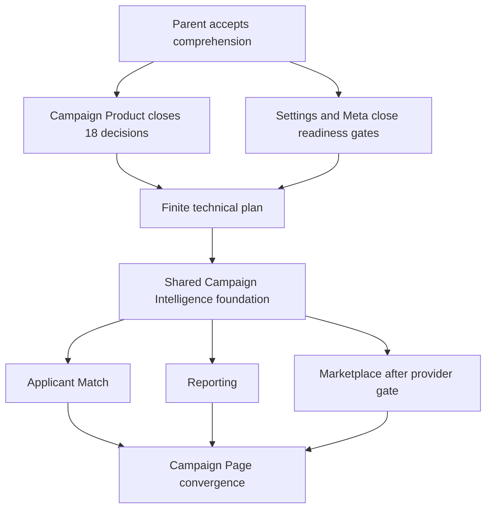

# Campaign Intelligence Integration SA — Orientation, Dependency and Readiness Audit V1

`CAMPAIGN_INTELLIGENCE_INTEGRATION_SA_ORIENTATION_DEPENDENCY_AND_READINESS_AUDIT_V1`

```text
AUDIT_DATE_UTC = 2026-09-15
RESULT = READY_FOR_PARENT_COMPREHENSION_REVIEW
SCOPE = ORIENTATION + DEPENDENCY + CONNECTIVITY + READINESS ONLY
OPEN_PRODUCT_DECISIONS = 18
PROVIDER_VALIDATIONS = 8
AUTHORITY_CONFLICTS = 0
IMPLEMENTATION_STARTED = NO
BACKEND_CHANGED = NO
FRONTEND_CHANGED = NO
MIGRATIONS_CHANGED = NO
LIVE_META_CALLS = NONE
META_PROVIDER_MUTATIONS = NONE
DEVELOPMENT_MERGE = NOT_PERFORMED
DEPLOYMENT = NOT_PERFORMED
```

## Executive determination

The charter is adopted. I understand this role as the technical integration authority for three separate Campaign intelligence capabilities, not as the Campaign Product owner and not as a replacement Campaign Page Systems Architect. Product meaning, UX semantics and the 18 open decisions remain with the Campaign Page SA/Parent. This role owns cross-engine topology, reuse, provider and Settings connectivity, implementation-method discipline and later technical acceptance only after Product authority is complete.

The audit supports the following conclusions:

1. The current Campaign runtime already supplies the canonical Campaign shell, three workspaces, application truth handoff and collaboration entry points. It intentionally supplies no canonical Reporting, Applicant Match or Marketplace intelligence.
2. Shared DE, Evidence and Intelligence facilities are mature enough to reuse. A second acquisition runtime, Evidence store, current store, scheduler or token path is prohibited.
3. Applicant Match and Reporting are independent Product capabilities sharing a technical foundation. Marketplace adds an external provider gate and must not be conflated with either.
4. Creator Audience V1 is now through accepted P2; P3 and final evidence remain outstanding. Portfolio and Media Kit are not started. The earliest safe engineering boundary is **Option A: after full Audience V1 acceptance**, while the existing Parent scheduling guardrail remains after complete Creator Centre until Parent changes it.
5. Marketplace provider readiness is not currently green. The only live Meta app lacks approved/live Creator Marketplace Discovery; the marketplace-named apps are development-mode without a review submission or usable privileges. Settings' generic Instagram connection state is therefore insufficient.
6. The supplied recovery artifact has now been published byte-for-byte and independently fetched back. Its former Git-route blocker is cleared. It is durable recovery evidence ready for Parent Product review, but its 18 decisions remain open and it is not a frozen Product register.

## A. Role and authority comprehension

The Campaign Page SA owns Campaign Product meaning and the final Campaign Page experience. Campaign owns its aggregate, triggers, accepted intelligence references, lifecycle/history/staleness and server projections. Shared Intelligence owns generic definition/contract registration, execution identity, attempts, generation/component/current transition and telemetry. DE/Evidence owns acquisition, normalization, provenance, time and source fencing. Settings owns Meta connection, authorization generation, provider identity, secrets and capability readiness. C03 owns Application truth; C04 owns accepted-applicant Collaboration, per-deliverable execution/publishing/completion truth. The frontend presents strict server DTOs and does not calculate scores or campaign metrics.

This audit may identify gaps, recommend an earliest boundary and propose a non-binding dependency shape. It may not freeze Product decisions, select final weights, create implementation packets, change provider configuration, modify runtime repositories, merge or deploy.

## B. Exact repository, ref, SHA, tree and migration inventory

All repository observations below follow `git fetch --all --prune` on 2026-09-15. A ref is a source of current or accepted evidence only within its stated authority; divergent program branches are not assumed integrated.

### Program authority and publication

| Purpose | Ref | Commit SHA | Tree SHA | Status |
|---|---|---|---|---|
| Authority integration base | `dummy_tcs origin/main` | `3415a8b7ef155e115b77da3335795ff8ab05de3f` | `271ee57776f87970eebb1d014d3fac188ce01fac` | fetched current main |
| Campaign Intelligence authority branch, recovery checkpoint | `program/campaign-intelligence-integration-sa-authority` | `6d3768f967c6a199a96a8690a51bffcf51182a7f` | `4c850852bec28060144572e59d34da282de59579` | normal connector publication; independently fetched |
| C03 authority | `origin/c03/recovery-authority` | `df32e63e4ca44de57b40be59167c300ecb886ddd` | `1f23bcb17dad57d2a3f7704c40d641b28c234508` | accepted/closed |
| C04 authority | `origin/c04/stage-b-authority-package-v1` | `7790864dbd4764b9a4118856e3ca074fb374ce7e` | `41b1d63ccacfff11a459720ccf0be001c80d2672` | Parent final acceptance |
| Instagram Intelligence authority | `origin/program/instagram-intelligence-v1-authority` | `b3f04918435db5043c5498ea92250762047291b1` | `253ea239ffa2cdb9f1f87c546037c4a722512b46` | accepted donor |
| Creator Audience V0 authority | `origin/program/creator-audience-v0-authority` | `52917dfe2bbd7e92ceeb5ffcfe2b628fa49bd598` | `962ae60987d83fba313f81265faa3aa1f0163a50` | accepted donor |
| Creator Content V0 authority | `origin/program/creator-content-v0-authority` | `cb9ee23118eafb2dc156c25eb09702ea93252db4` | `26c1598ed4a90ecef5d0d1c14145945a5a7304aa` | accepted donor |
| Creator Brand V0 authority | `origin/program/creator-brand-v0-authority` | `08c72433b32ed8a199d29ae8875d668dc2f0eddf` | `d9decab31d9bee7251bbbf675af95a29dafd08c9` | accepted donor |
| Creator Commercial authority | `origin/program/creator-commercial-setup-rate-card-v0-authority` | `897026bb39e7390397b9fea48a696ee488c31a4c` | `773f17c08312b5b9dc8ff25094e54ab2bdf1004c` | accepted donor |
| Creator Audience V1 authority | `origin/program/creator-audience-v1-authority` | `9495d22547214554cce2363f05bd708c510415db` | `f2378cba9ee5fd960e6a01aaf524831dc2b3911e` | P0/P1/P2 accepted; P3 not started |

### Runtime repositories

| Surface | Ref | Commit SHA | Tree SHA | Migrations / head | Interpretation |
|---|---|---|---|---|---|
| Backend current development | `origin/development` | `4c5f42858b950b7cd342f8972f99f548f3daa942` | `5f9b82c09abfe021e2421a0e8debea6ac777429d` | `74` / `20260909123000_c05_p0_payout_destination` | current integration base |
| Frontend current development | `origin/development` | `323658d4b147b95b5629ff8d91fa90b8fe9077e4` | `4ff40849c64a98429a89cc8e4f1ff6949815070c` | n/a | current integration base |
| Bounded later Campaign correction | backend `origin/campaign/bp-g05-exact-net-terms-persistence` | `2e18f02e609783505139acc9ac0595638c8fe06e` | `36bcae350f8cd28e3a25c93cbd21bdbcacd98513` | `76` / `20260910121000_campaign_bp_g05_reconcile_exact_payout_terms` | accepted Campaign BP-G05 correction; not a full Campaign Page integration |
| C03 accepted module | backend `origin/c03/recovery-campaign-participation-v1` | `aebeb85fd6bba37f88c3805c213c61e7f63b2f5f` | `86c5bb769598dd19a634dcd867350e53eaa06f75` | `79` / `20260910122000_c03_application_handoff_notifications` | module-final handoff |
| C03 accepted module | frontend `origin/c03/campaign-participation-v1` | `82ed3c9ef849be8353565a1901b6f5fb065c37e1` | `f039d59aef7b0c8dd1fdb6ebb34cda961761c597` | n/a | module-final handoff |
| C03 development integration | backend `origin/integration/c03-campaign-participation` | `b4886efab8eb93bcd0576cbe13efad1d77b881d4` | `4a6893f85e1be0c3ecaeec86caf06e2411ea5ada` | `87` / `20260910122000_c03_application_handoff_notifications` | integration candidate, not development |
| C03 development integration | frontend `origin/integration/c03-campaign-participation` | `26e1a0d095c225070b75c4d37ab896d9dbefcbb0` | `9490b3a51bd54a6b486832f48b0b9110fccf03bc` | n/a | integration candidate, not development |
| C04 accepted runtime | backend `origin/c04/shared-collaboration-backend-v1` | `fc4d4b59e2a44d7ddced6bc5dde5119c501ec275` | `083c52dc06c19a23f47491935b472ee5e62bd1c5` | `84` / `20260911124000_c04_bp_g05_reconcile_exact_payout_terms` | accepted C04 branch |
| C04 accepted runtime | frontend `origin/c04/shared-collaboration-frontend-v1` | `106de9988ea2d4bd534205b083f63ae7ecd1878c` | `6481cad5ca026ffeac6010f2e9724a1ee160c201` | n/a | accepted C04 branch |
| Instagram donor | backend `origin/program/instagram-intelligence-v1-backend` | `fef32afb0fdef52f00c7c22b3d0a85967a68fded` | `7ef6bd705b55ef82836b3f57f06a2832a867e781` | `91` / `20260914010000_instagram_w4_audio_observations` | accepted donor |
| Instagram donor | frontend `origin/program/instagram-intelligence-v1-frontend` | `5866d0ac82f742957f53a8db2144a9a166628b75` | `7c095290ffdef4c84f37382bc594bef536c92a49` | n/a | accepted donor |
| Creator Audience V0 | backend / frontend program refs | `7028d1fcbd467175a5358fce92ad2edd63ea44cd` / `4ca6141face77821f546a13bdde12c8c41780a6f` | `dbc9b8e00936d4ecbc700b516b17ad8ce78f2d17` / `f14d5076021a97137f505a91c81736021a8dc30a` | `101` / `20260914191000_creator_audience_owner_scope_lineage` | accepted donor |
| Creator Content V0 | backend / frontend program refs | `0fa145ac6a021337929e87b9eb9e0c67ebc82b7e` / `7edd26d3cdad0ec84083884b34039952368a1295` | `750065a56a4a060c125a9bee7ddc9fb842204e7e` / `0cc596ca1ef1d1c4a51857125547de156e487c8b` | `101` / `20260914191000_creator_audience_owner_scope_lineage` | accepted donor; supersedes SHA embedded in recovery artifact |
| Creator Brand V0 | backend / frontend program refs | `6206f43c6a13c304c971b810e1dd99a20aaaa11f` / `c505c0679e39effdd9608e319112591d5ae4c079` | `533f543612b856cfaf3b57769fe0b5541b803c3f` / `18dd8ed798aae509baa7d0d51ab8e31d7ac2dbbd` | `102` / `20260915100000_creator_brand_canonical_profile_revision` | accepted donor |
| Creator Commercial | backend / frontend program refs | `3504a3cc8f0dc684431b73046f5796f157708f68` / `e6e7ae8ea9f5f98f882f52230e4cae163bda1e89` | `de4b3ba41d3c6d96645f115a5d780660991a27c3` / `c77fd43a13251f3c0ba6733f5070fe49412bba1e` | `104` / `20260915210000_creator_rate_card_canonical_revision` | accepted donor |
| Creator Audience V1 P2 | backend / unchanged frontend refs | `d99cce6f8d7730e8eff7f7cc734ba8813bf822e7` / `e6e7ae8ea9f5f98f882f52230e4cae163bda1e89` | `c0101e6a5a07e156f6c46e2a328a8e948cdbc915` / `c77fd43a13251f3c0ba6733f5070fe49412bba1e` | `104` / `20260915210000_creator_rate_card_canonical_revision` | P2 accepted; P3/final evidence outstanding |

Migration-head Git blob OIDs were also checked: development `4dd2a7ec82136496309265312921e4c85ab91761`, BP-G05 `ae554fa5d679989640dc7719334d9d672668ae99`, C03 integration `e18810940916916582a4d3a5e1134712c0949575`, C04 `3a261ae2478fcf5a40a7963fb1d478704cd96938`, Instagram `8f45cbe51acd5d53a9b388d9a37e3c534af5ec20`, Audience/Content `9959c05e2272cc10cafee794710e24e602005c08`, Brand `8489b87213b630a690a47b5c7c95d3bb26dcfb6f`, and Commercial/Audience V1 `9aab41774f316091e5632185a55b429503e3f89c`.

### Historical Campaign discovery leads

| Lead | SHA | Tree | Classification |
|---|---|---|---|
| Historical backend Campaign Page | `f7eb11bc72051f034f7d46ff2ad5c6b4d4b9e0fd` | `4624c206fe93a47a0ace276b480342127ce27dc1` | discovery lead only; ancestor of later branches |
| Historical accepted frontend Campaign Page | `1987b30de56891a4f7f95758bddd27f4dbb2d868` | `a6392805f4f953b14dbd9cfe3bee941f370278c3` | discovery lead; source is present in later development |
| Stitch design reference | `53e9abd01a01c11b641d8d1bab175797bcbea3ad` | `94580bd9e2d2d3c5623c407e75c52f9693317dee` | visual reference, never runtime truth |

No existing Campaign Intelligence authority branch or target-path artifact was present before this publication, so the charter fallback branch was correctly used.

## C. Current Campaign module architecture map

The source audit used current backend/frontend development, then compared later bounded Campaign, C03 and C04 refs without pretending those branches were already converged.

| Concern | Canonical owner/current source | Observed behavior | Intelligence consequence |
|---|---|---|---|
| Create Campaign | `CanonicalCampaignCreateController` and canonical create/readiness/autosave services | guarded canonical wizard, drafts, readiness and publish | Campaign owns context and trigger eligibility, not score/report calculation |
| Campaign aggregate/list/shell/edit/lifecycle | `BrandUceController`, `CampaignQueryService`, Campaign readiness/lifecycle services | Brand-scoped aggregate and server-computed lifecycle capabilities | reuse Campaign identifiers, versions and lifecycle; do not create parallel aggregate |
| Product/Asset | Campaign asset service and canonical selectable-asset routes | canonical asset references plus legacy compatibility routes | consume canonical accepted references; legacy records are compatibility only |
| Brief | canonical brief service/routes | canonical brief create/read/detail and edit handoff | freeze/reference the appropriate brief version in evaluation inputs |
| Discovery | `CampaignQueryService.getCampaignDiscovery` | up to 50 stored campaign creators; provider and intelligence explicitly unavailable | Marketplace must populate through a provider-gated, versioned recommendation path |
| Applications | `CampaignApplicationService` and C03 handoff | canonical Applications with immutable `ApplicationSnapshot`; approve/reject remain available without AI | Match is snapshot-bound, read-only decision support and never an approval gate |
| Collaboration entry | application approval transaction and `CollaborationProvisionService` | approving an Application supersedes competing pending state and provisions C04 | C04 execution identity is an input/reference, not duplicated Campaign state |
| Reporting | canonical Campaign page `performanceSummary` | deliberately `UNAVAILABLE`; no fake values | new canonical Reporting is required; legacy service is not the donor |
| Authorization | `BrandUceAccessService` plus controller guards | Brand ownership and broad role checks; lifecycle capability flags | no complete Campaign role/action matrix exists; Product/SA input required |
| Persistence | Prisma Campaign/Application/CampaignCreator/Collaboration-related models on divergent refs | application snapshot and collaboration foundations exist on accepted branches | convergence base and migration topology must be selected later, not inferred here |

Current canonical Campaign Page does **not** use legacy `BrandUceReportingService` or legacy creator-marketplace scoring as its truth. Those services remain reachable through compatibility routes and include missing-to-zero / legacy `matchScore` behavior. They are explicitly prohibited donors for the three new capabilities.

## D. Campaign Page route, tab, query and action map

### Route and shell

| UI/route | Backend read/command | Authorization/action | Presenter | Current state/failure behavior |
|---|---|---|---|---|
| `/brand/uce/campaigns` | campaign aggregate/list query | authenticated Brand scope | Campaign list/shell | loading/error/empty supported |
| `/brand/uce/campaigns/create` | `POST /campaigns/canonical-wizard`, canonical draft/readiness/autosave routes | controller guards + Brand ownership/readiness | canonical create flow | draft/readiness validation and error states |
| `/brand/uce/campaigns/:id` | `GET /campaigns/:campaignId/page` | Brand ownership | `BrandUceCampaignDetailPage` → `CanonicalCampaignPage` | loading/error, lifecycle and terminal read-only states |
| Discovery tab | `GET .../discovery` | ownership; no dedicated role/action contract | `CampaignWorkspaceShell` / workspace content | READY/EMPTY/UNAVAILABLE; provider and intelligence currently unavailable |
| Applicants tab | `GET .../applications`, approve/reject commands | ownership plus command guards | applicants workspace/detail | loading/error/empty; intelligence `UNAVAILABLE`; domain action remains usable |
| Collaborations tab | Campaign/C04 references and counts | accepted application/C04 authority | collaboration workspace/entry | empty/reference/read-only as applicable; C04 owns execution |
| Product/Brief detail and add/edit handoffs | Campaign product/brief detail and canonical asset/brief routes | lifecycle/readiness capabilities | drawers and handoff links | compatibility is surfaced rather than silently normalized |
| Share/outreach | share/outreach commands/drawers | guarded command | share modal/outreach drawer | separate from Marketplace retrieval and messaging permission |
| Publish/go-live | Campaign lifecycle commands | server lifecycle/readiness capability | Campaign actions | server-authoritative failure, not frontend inference |
| Reporting attention | page `performanceSummary` | none while unavailable | `CampaignAttentionPanel` | explicit Reporting unavailable |

The current runtime renders exactly three workspaces—Discovery, Applicants and Collaborations—rather than hiding them progressively. Each workspace receives a server state. Older progressive-navigation documentation is a supersession lead requiring a formal bibliography citation, not a reason to alter the current shell.

### Current frontend contract and test state

- Typed Campaign clients/hooks and models exist, but the Campaign Page boundary presently casts backend JSON into TypeScript types rather than validating all runtime payloads with a strict schema.
- The frontend performs no canonical intelligence calculation.
- `ReportingDrawer` rejects legacy payloads and can render canonical unavailability, but the current attention panel does not open it; full reporting UX is not connected.
- Current states cover loading, error, empty, unavailable, compatibility and terminal read-only. Full stale/partial/failed-current-preserved Reporting and Marketplace degradation states do not yet exist.
- There is no complete role-resolved `availableActions` DTO. Current capabilities are primarily lifecycle/readiness flags. This is a Campaign SA gap, not permission to invent a matrix.
- Backend focused tests include canonical create/readiness/query/application/lifecycle/authorization and legacy reporting tests. Frontend focused tests include API clients, Campaign Page model/workspace/page and campaign continuation. Both repositories use Vitest. No Campaign-specific Playwright/Cypress harness was found in current development; later acceptance must pin a real browser harness and the charter viewport/Axe/console requirements.

### Executable deferred-contract status

Repository-wide inspection of current development found no executable definitions named:

```text
publishApplicantIntelligenceInputSchema = ABSENT_FROM_CURRENT_EXECUTABLE_DEVELOPMENT
publishCampaignReportCalculationInputSchema = ABSENT_FROM_CURRENT_EXECUTABLE_DEVELOPMENT
publishCreatorRecommendationInputSchema = ABSENT_FROM_CURRENT_EXECUTABLE_DEVELOPMENT
```

These names exist only in historical/proposed documentation. They must not be described as current consumer contracts.

## E. Campaign Reporting comprehension

**Purpose.** Post-collaboration Campaign performance and interpretation once Product-defined eligibility/stability is met. It answers how the Campaign performed, what evidence supports that answer and what the Brand can learn. It excludes Discovery funnel reporting, Applicant ranking, creator-account analytics, payout-ledger truth and pre-launch planning. `PULSE / PROOF / PRODUCTION / PUSH` is prohibited legacy vocabulary.

**Inputs and ownership.** Campaign supplies objective (`AWARENESS / TRUST / ASSETS / ACTION`), version, brief and accepted references. C04 supplies collaboration, per-deliverable production/publishing/completion truth. Instagram DE/Evidence supplies immutable media/insight evidence with observed/captured time and provenance. Deterministic Campaign-owned definitions derive metrics; Campaign Intelligence derives Result → Signal/Pattern → Learning under Product thresholds. Commercial/payout facts remain with their owners and are admitted only if Product authorizes them.

**Required behavior.** Every result must carry sample, denominator, coverage, window, freshness/finality and evidence references. Missing/unavailable is not zero. Partial evidence is explicit. A failed refresh preserves the last valid current result and records failure separately. One result cannot be promoted to Pattern/Learning without the frozen threshold.

**Open decisions.** `R-PD-01` through `R-PD-06` below block a final definition bundle and UX contract.

## F. Applicant AI Match comprehension

**Purpose.** Campaign/Brand × a specific submitted Application evaluation after application submission/authorization. It is not sourcing, Meta ordering, a global Creator score or a Brand decision.

**Authoritative anchor.** The immutable C03 `ApplicationSnapshot`, plus explicitly versioned Campaign/Brief context. Applicant Match is read-only and nonblocking: approve/reject remain available in PROCESSING or UNAVAILABLE states.

**Candidate input classes.** Final classification remains Product-authoritative, but the technical audit separates inputs as follows:

| Class | Candidate inputs |
|---|---|
| Hard eligibility | Application/Campaign integrity, deterministic campaign constraints explicitly frozen by Product |
| Scoring input | Campaign objective/target/deliverables/Brief; admitted Brand/Offering; Creator Audience, Content and Brand; Work Preferences; Rate Card/commercial compatibility; admitted Instagram performance/evidence |
| Explanation-only context | evidence details that support a reason but are not admitted to the numeric rubric |
| Optional enhancer | Portfolio and prior verified C04 work if Product admits them |
| Unavailable/non-admissible | missing, stale, unverified or owner-disallowed evidence; Media Kit presentation; provider search order |

One authoritative numeric score is visible only in Applicants when READY; Discovery uses qualitative recommendation reasons/bands. Evidence coverage/confidence cannot be disguised as a score. Re-evaluation/supersession while an Application is pending remains open.

## G. Creator Marketplace Recommendation comprehension

**Purpose and pipeline.** This is the complete pre-application path:

```text
Campaign context
→ Meta Creator Marketplace candidate retrieval
→ deterministic provider/campaign eligibility filters
→ admitted Intelligence/Evidence enrichment
→ campaign-specific ranking
→ qualitative reasons/bands
→ versioned Discovery candidate pool
```

Meta payloads and search ordering are provider evidence, not Product truth. Recommendation is campaign-specific, never a universal Creator rank. It is distinct from outreach/messaging, Application review and C04 execution.

The historical weights—Audience 30%, Content 25%, Performance 20%, Brand/Commercial 15%, Quality/Confidence 10%—remain **provisional and unfrozen**. No weight or sub-weight may enter code until `M-PD-03` and related evidence decisions are closed.

Marketplace must degrade without blocking Manual/CSV entry. Provider failure, exhausted retrieval or missing enrichment must be explicit and must not erase a previously accepted candidate set unless the frozen invalidation policy requires it.

## H. Exact distinctions among the three capabilities

| Capability | Phase/object | Output | Must not become |
|---|---|---|---|
| Reporting | post-collaboration Campaign execution | evidence-backed metrics and Result/Signal/Pattern/Learning | funnel analytics, Applicant rank, creator analytics or payout ledger |
| Applicant AI Match | post-application `ApplicationSnapshot` | Applicants-only numeric decision support plus reasons/confidence | sourcing, Meta rank, global Creator score or approval gate |
| Marketplace Recommendation | pre-application Campaign candidate pool | Discovery ordering/bands/reasons from provider retrieval plus admitted enrichment | Meta order, Applicant Match, outreach/messaging or Collaboration execution |

## I. Recovery-artifact publication and trust status

The supplied recovery bytes were preserved exactly:

```text
SOURCE_SHA256 = 34b1c8ddd868870e5321cf6117b635db2b3235114a95d8d7e966ee41983f241b
PUBLISHED_SHA256 = 34b1c8ddd868870e5321cf6117b635db2b3235114a95d8d7e966ee41983f241b
PUBLISHED_PATH = docs/ai-collaboration/campaign-page/CAMPAIGN_PAGE_REPORTING_AI_MATCH_MARKETPLACE_RECOMMENDATION_PRODUCT_DECISION_RECOVERY_V1.md
PUBLICATION_COMMIT = 6d3768f967c6a199a96a8690a51bffcf51182a7f
PUBLICATION_TREE = 4c850852bec28060144572e59d34da282de59579
INDEPENDENT_FETCH_BACK = PASS
FETCHED_COMMIT_EQUALITY = PASS
FETCHED_TREE_EQUALITY = PASS
FETCHED_BYTE_HASH_EQUALITY = PASS
```

The charter archive was likewise exact: source/published SHA-256 `ca49f0c32910caaea6ac488c6d7bdcb531d228ecf6983410bef06b5be7966822`.

**Trust determination:** the prior “not published” route blocker is cleared. The artifact is now a durable, fetched Git record of the Campaign Page SA's recovery and is ready for Parent Product review. It is not a frozen Product decision register: its 18 Product decisions and eight provider validations remain explicitly open. Its embedded `CURRENT_STATE_BLOCKED` line is retained as historical source-session state; this audit supplies the publication/revalidation attestation rather than altering supplied bytes.

Current-state corrections recorded by this audit are not semantic contradictions: Audience V1 is now accepted through P2 rather than P1; Creator Content's donor SHA has advanced; current Meta rate/version evidence has advanced; and the three proposed `publish...Schema` names are absent from executable development. No equal-authority conflict was found.

## J. Open Product decisions and provider validations

### 18 Product decisions

| ID | Decision | Blocking effect | State |
|---|---|---|---|
| `R-PD-01` | Reporting eligibility/stable-evidence threshold | blocks first eligible calculation/current promotion | OPEN — Parent Product |
| `R-PD-02` | objective → KPI/metric authority | blocks definition bundle | OPEN — Parent Product |
| `R-PD-03` | reporting windows, cadence and finality | blocks generation/freshness contract | OPEN — Parent Product |
| `R-PD-04` | attribution and efficiency scope | blocks admissible inputs/metrics | OPEN — Parent Product |
| `R-PD-05` | Pattern/Learning threshold | blocks semantic promotion | OPEN — Parent Product |
| `R-PD-06` | comparison baseline | blocks comparative result UX | OPEN — Parent Product |
| `A-PD-01` | numeric scale and rounding | blocks score contract | OPEN — Parent Product |
| `A-PD-02` | dimensions, weights and objective variants | blocks rubric | OPEN — Parent Product |
| `A-PD-03` | hard gates versus scoring | blocks eligibility/evaluation split | OPEN — Parent Product |
| `A-PD-04` | evidence sufficiency and confidence | blocks READY/UNAVAILABLE threshold | OPEN — Parent Product |
| `A-PD-05` | explanation contract | blocks consumer DTO/UX | OPEN — Parent Product |
| `A-PD-06` | re-evaluation/supersession while Pending | blocks generation/current policy | OPEN — Parent Product |
| `M-PD-01` | initial retrieval and refresh trigger | blocks orchestration trigger | OPEN — Parent Product |
| `M-PD-02` | hard-filter contract | blocks candidate eligibility | OPEN — Parent Product |
| `M-PD-03` | ranking rubric and normalization | blocks recommendation definition | OPEN — Parent Product; historical weights provisional |
| `M-PD-04` | evidence sufficiency/graceful degradation | blocks readiness/current behavior | OPEN — Parent Product |
| `M-PD-05` | candidate-pool and enrichment budget | blocks bounded execution | OPEN — Parent Product/provider-informed |
| `M-PD-06` | exclusion/dedupe after retrieval | blocks candidate-set semantics | OPEN — Parent Product |

### Eight provider validations

| ID | Validation | Read-only evidence now available | Exact remaining gap/state |
|---|---|---|---|
| `PV-01` | current Marketplace app/access/permission authority | app inventory and live-app privilege state inspected | **BLOCKED:** no accessible production app currently has approved/live discovery permission |
| `PV-02` | search/discovery endpoint contract | docs identify `/<IG_USER_ID>/creator_marketplace_creators` under Instagram API with Facebook Login | live v26 request/response, eligible brand/page/token and exact query contract still unproven |
| `PV-03` | detail capability separation | docs separate discovery result, username-driven details, insights/media/portfolio | exact field availability by access level/test vs live data remains to be proven |
| `PV-04` | demographic suppression/sample/latency | docs expose audience/demographic concepts | thresholds, suppression, minimum sample and latency/freshness remain open |
| `PV-05` | pagination/rate/batching | current docs state 1,000 calls/account/hour and app-level `1,000 × effective users/hour` | cursor continuation, batching, backoff and production headers/errors need live proof |
| `PV-06` | media identity/presentation | docs identify media IDs/type/permalink/thumbnail/time/caption/tags/engagement fields | signed/ephemeral URL retention, Stories coverage and presentation license/expiry remain open |
| `PV-07` | messaging separation | separate `instagram_creator_marketplace_messaging` permission/prerequisites confirmed | discovery design must exclude messaging; any future messaging requires separate authority |
| `PV-08` | deauth/disconnect/delete/fencing | current app settings, callbacks, webhook count and Settings lifecycle inspected | live app has no deauth callback, deletion URL is not provider-owned/fit, zero webhook subscriptions; retention/fencing proof remains open |

## K. Exact bounded Campaign Page SA follow-up request

Before finite implementation planning, Parent should relay this single bounded request to the Campaign Page SA:

```text
CAMPAIGN_PAGE_SA_TO_CAMPAIGN_INTELLIGENCE_INTEGRATION_SA_HANDOFF_REQUEST_V1

Please return one Git-published, fetched and authority-classified handoff that:
1. cites the exact recovery bytes and accepts or corrects this audit's publication checkpoint;
2. provides the complete source/supersession bibliography for every recovered final/provisional/superseded decision;
3. resolves R-PD-01..R-PD-06, A-PD-01..A-PD-06 and M-PD-01..M-PD-06, with blocking level and final owner;
4. consumes PV-01..PV-08 outcomes without inventing provider capability;
5. selects exact Campaign backend/frontend/program-authority integration bases and required C03/C04 convergence refs;
6. pins the intended migration base, count, head and immutable predecessor checksums;
7. freezes the Campaign route/tab/navigation behavior, including three-workspace visibility and unsupported Stitch elements;
8. freezes Reporting, Applicants and Discovery UX states including loading/empty/error/partial/stale/unavailable/failed-current/terminal behavior;
9. provides the exact server DTO/query boundaries and version/invalidation semantics;
10. provides the Campaign role × action × lifecycle matrix and authoritative availableActions behavior;
11. defines Campaign edit/version invalidation for reports, applicant evaluations and recommendation sets;
12. defines Reporting eligibility/stability, window, coverage, denominator, freshness and finality;
13. defines Applicants-only score visibility, scale, explanations, confidence and nonblocking behavior;
14. confirms Discovery qualitative-only presentation and Manual/CSV graceful degradation;
15. classifies publishApplicantIntelligenceInputSchema as absent/new/superseded and supplies the accepted contract if new;
16. classifies publishCampaignReportCalculationInputSchema as absent/new/superseded and supplies the accepted contract if new;
17. classifies publishCreatorRecommendationInputSchema as absent/new/superseded and supplies the accepted contract if new;
18. cites exact accepted C03 Application/ApplicationSnapshot and C04 Collaboration/publishing/completion handoff refs;
19. pins current fixtures, focused tests, browser/Axe harness and inherited debt baselines;
20. gives explicit Product acceptance and the next technical-planning authority checkpoint.

Do not request implementation in this handoff.
```

## L. Accepted donor inventory

| Donor | Accepted capability to reuse | Boundary to preserve |
|---|---|---|
| Shared DE | Resource, Capture, ContentArtifact, Evidence, SemanticObservation; provider-neutral acquisition/adapters | provider bytes/evidence are not Product truth |
| Shared Evidence | provenance/parent evidence, observed/captured time, coverage/quality/freshness, tenant/owner/provider-account/auth-generation fencing | no parallel Campaign evidence store |
| Shared Intelligence | registry/bundles, execution identity/replay, attempts, generation/component/current, CAS transition, telemetry, failed-current preservation | no direct current writes or second generalized scheduler |
| Brand Intelligence/Offering | accepted Brand and Offering semantics/evidence | use only admitted versions; Campaign evaluation remains campaign-owned |
| Brand Instagram Intelligence | Instagram source/evidence foundations and readiness pattern | not a Marketplace permission grant and not Campaign Reporting |
| Creator Audience V0/V1 | verified audience semantics, source admission, owner scope and read-only current | V1 must reach final acceptance before recommended start |
| Creator Content V0 | content inventory/semantics and multimodal provenance | do not infer campaign fit globally |
| Creator Brand V0 | confirmed profile/brand-fit evidence | candidate input, not final score authority |
| Work Preferences | creator-owned availability/preferences revisions | deterministic compatibility input only when Product admits it |
| Rate Card/Commercial | creator-owned commercial revisions/readiness | no payout truth duplication; currency/terms remain owner facts |
| Portfolio | no accepted implementation yet | optional verified enhancer only; DEFER until accepted |
| C03 | Application and immutable ApplicationSnapshot | Match attaches to snapshot; no Application duplication |
| C04 | Collaboration, deliverable production/publishing/completion | Reporting consumes evidence; Campaign does not own execution |
| Settings — Brand | connection lifecycle, encrypted token custody, account identity, authorization generation, disconnect/delete | Campaign never reads tokens or starts OAuth |

## M. Reuse/add/defer/prohibit matrix

| Surface | Classification | Determination |
|---|---|---|
| DE Resource/Capture/Artifact/Evidence/Observation | `REUSE` | mandatory shared path |
| provider-neutral adapters and acquisition telemetry | `REUSE_WITH_CAMPAIGN_ADAPTATION` | add Marketplace adapter/use-case wiring only behind provider gate |
| shared Intelligence registry/execution/generation/current/CAS | `REUSE` | all three definitions use one runtime |
| Campaign evaluation/report/recommendation definitions | `CAMPAIGN_SPECIFIC_ADD` | Product-frozen definitions, versions and outputs |
| common Campaign context/input snapshot and accepted-result references | `SHARED_FOUNDATION_ADD` | one bounded Campaign Intelligence foundation, not three copies |
| Brand/Offering/Creator accepted current projections | `REUSE_WITH_CAMPAIGN_ADAPTATION` | freeze source/version/evidence refs per evaluation |
| C03 ApplicationSnapshot | `REUSE` | Match anchor |
| C04 execution/publishing/completion evidence | `REUSE_WITH_CAMPAIGN_ADAPTATION` | Reporting input only |
| Portfolio | `DEFER` + optional enhancer | no accepted runtime; absence must be nonblocking unless Product changes authority |
| Media Kit | `DEFER` / `NOT_A_DEPENDENCY` | presentation consumer, not source truth |
| Settings overall connection green | `PROHIBITED` as sole Marketplace gate | lacks permission/app/path-specific readiness |
| Settings capability projection | `SHARED_FOUNDATION_ADD` owned by Settings | smallest owner-correct addition |
| Meta discovery adapter and live Marketplace execution | `PROVIDER_GATED` | PV-01..PV-08 required |
| legacy `BrandUceReportingService` | `PROHIBITED` | false-zero/legacy semantic behavior |
| legacy creator `matchScore` / provider ordering | `PROHIBITED` | neither Applicant Match nor Campaign recommendation truth |
| Campaign-owned OAuth/token store | `PROHIBITED` | violates Settings ownership |
| frontend scoring/metric calculation | `PROHIBITED` | server definitions/DTOs are authoritative |

## N. Shared Campaign Intelligence foundation hypothesis

This is a comprehension hypothesis, not a frozen plan. One shared Campaign layer should register versioned feature definitions with the accepted Intelligence runtime, construct immutable owner-scoped input snapshots from Campaign plus admitted donor references, execute with idempotent identities, publish through generation/component/current CAS transitions, preserve prior current on failure, and expose Campaign-owned accepted-result references/history/staleness through strict query DTOs.

Feature definitions remain separate:

- Reporting definition: Campaign/C04/publishing/evidence → deterministic metrics → evidence-grounded interpretations.
- Applicant Match definition: Campaign/Brief/ApplicationSnapshot/admitted donor evidence → eligibility + numeric Applicants-only evaluation.
- Marketplace definition: provider candidate-set version + Campaign context + admitted donor evidence → campaign-specific qualitative Discovery recommendation.

Candidate object names such as Campaign-Creator Evaluation, Applicant Match Evaluation and Discovery Recommendation Set remain provisional until Product/contract authority freezes them.

## O. Settings — Brand connectivity assessment

Current Settings owns and returns non-secret integration state including provider account reference, authorization health, authorization generation, token issuance/expiry/refresh classification without token values, capabilities and role-based allowed actions. Prisma already contains `businessDiscovery` and `creatorMarketplaceDiscovery` capability fields, presently defaulting to `DEFERRED`.

The accepted Instagram flow requests Instagram Login basic/insights permissions. Creator Marketplace Discovery instead requires the Facebook Login/Page-linked brand path and additional permissions. Therefore an overall `CONNECTED` or generic Instagram green signal is not sufficient.

The smallest owner-correct addition is a Settings-owned, non-secret Marketplace capability projection containing:

```text
connection state
provider app/path and account/page identity references
authorization generation
token health/expiry classification without token material
permission/capability snapshot version
MARKETPLACE_DISCOVERY_AVAILABLE | DEFERRED | UNAVAILABLE | REAUTH_REQUIRED
review/configuration/eligibility reason codes
last verified time
account-change/reconnect/deauth/delete invalidation state
```

Campaign reads this projection and never tokens. It does not initiate a second OAuth flow. Settings owns any future permission/path change under separate authority.

## P. Meta read-only connector evidence and uncertainties

No live Graph/Marketplace endpoint was called. No token was read or printed. No OAuth, App Review, permission, redirect URI, webhook, deauthorization or deletion setting was changed.

### App evidence

| App ID/name | Mode | Relevant state | Readiness conclusion |
|---|---|---|---|
| `1180027506417007` — The Creator Shop | Live | advanced/live `pages_show_list`, `pages_manage_metadata`, `instagram_basic`, `instagram_business_basic`, `instagram_business_manage_insights`; Creator Marketplace Discovery rejected/not live; review submission rejected | existing production app is not Marketplace-ready |
| `2740399296361435` — The Creator Shop - Test1 | Development | no review submission/privileges; creator-marketplace redirect paths exist | test configuration only |
| `26787506760925326` — creator marketplace API | Development | no review submission/privileges; business/privacy readiness incomplete | not production authority |
| `1718441312765233` — creator marketplace API 2 | Development | no review submission/privileges; business/privacy readiness incomplete | not production authority |
| `1415402150448183` — creator marketplace AP - Test1 | Development | no review submission/privileges; business/privacy readiness incomplete | not production authority |

The live app has zero webhook subscriptions, no deauthorization callback, and a data-deletion URL that is not an application-owned deletion endpoint. Compliance reports no open action, but that does not cure Marketplace permission, callback or deletion-contract gaps. Connector deprecation evidence reports current platform version `v26.0`, matching the repository default, with no listed deprecations.

### Current documentation evidence

- Creator Marketplace API is exposed under Instagram API with Facebook Login, not the current Instagram Login-only insights path.
- Documented permissions include `instagram_creator_marketplace_discovery`, `instagram_basic`, `pages_manage_metadata`, `pages_show_list` and `business_management`; advanced access is required for production discovery.
- The request requires a Page access token for a Page linked to the Brand's Instagram business account, plus brand eligibility/onboarding and Marketplace terms.
- Documented candidate/detail data may include identity, profile, country, demographics for onboarded creators, insights, portfolio URL, recent/branded media and past partnerships; exact access-level and population behavior still requires validation.
- Messaging uses the separate `instagram_creator_marketplace_messaging` permission and is outside this capability.
- The current published limit is 1,000 calls per account per hour and app-level `1,000 × effective users` per hour; production pagination/error/backoff remains unproven.

Provider uncertainty remains sufficient to gate Marketplace implementation, but not to block Product decisions, shared-foundation comprehension or read-only preflight.

## Q. Creator Centre dependency matrix

| Creator dependency | Shared foundation | Applicant Match | Reporting | Marketplace preflight | Marketplace ranking |
|---|---|---|---|---|---|
| Audience V1 final acceptance | `HARD_PRODUCT_DEPENDENCY` for recommended starting contract | `HARD_PRODUCT_DEPENDENCY` for admitted audience semantics | `NOT_A_DEPENDENCY` | `NOT_A_DEPENDENCY` | `OPTIONAL_QUALITY_ENHANCER`, but included in program start boundary |
| Portfolio acceptance | `NOT_A_DEPENDENCY` | `OPTIONAL_QUALITY_ENHANCER` | `NOT_A_DEPENDENCY` | `NOT_A_DEPENDENCY` | `OPTIONAL_QUALITY_ENHANCER` |
| Media Kit | `NOT_A_DEPENDENCY` | `NOT_A_DEPENDENCY` | `NOT_A_DEPENDENCY` | `NOT_A_DEPENDENCY` | `FUTURE_ENRICHMENT`, not source authority |
| Creator Content/Brand V0 | accepted donor | scoring/explanation candidate | creator contribution candidate if Product admits | no dependency | admitted enrichment candidate |
| Work Preferences/Rate Card | accepted donor | deterministic compatibility candidate | `NOT_A_DEPENDENCY` except explicit commercial metric decision | no dependency | filter/enrichment candidate if Product admits |
| Complete Creator Centre convergence | not technically required after Audience V1 acceptance | not required when Portfolio remains optional | not required | not required | not required by current semantics |

Answers to the charter questions:

1. Shared foundation can safely start after **full Audience V1 acceptance** and Parent authorization.
2. Applicant Match can start after Audience V1, with Portfolio explicitly partial/optional.
3. Reporting requires no unfinished Creator Centre surface.
4. Portfolio is additional verified evidence, not a hard Match dependency under recovered decisions.
5. Media Kit is not a dependency for any of the three.
6. Marketplace provider/readiness preflight can proceed independently of Creator Centre; live implementation remains provider-gated.
7. No identified work must wait for complete Creator Centre convergence unless Parent converts Portfolio/Media Kit into a hard Product input or chooses a scheduling hold.

## R. Earliest-safe-start recommendation

```text
EARLIEST_SAFE_START = AFTER_AUDIENCE_V1
OPTION = A
AUDIENCE_V1_CURRENT_STATE = P0_ACCEPTED + P1_ACCEPTED + P2_ACCEPTED; P3_NOT_STARTED; FINAL_EVIDENCE_NO
```

Option A is the earliest safe engineering boundary because it stabilizes the shared verified Audience semantics without making Portfolio or Media Kit artificial dependencies. Reporting itself has no unfinished Creator dependency; Marketplace preflight is independently runnable; Portfolio is an optional enhancer; Media Kit is a downstream presentation consumer.

This is an engineering recommendation only. The existing Parent scheduling guardrail remains **after complete Creator Centre** until Parent explicitly changes it. Nothing starts at this checkpoint.

## S. Preliminary dependency DAG and packet grouping



Non-binding packet boundaries for later planning:

1. Shared Campaign Intelligence contracts/adapters/current/query foundation.
2. Applicant Match, independently acceptable and nonblocking.
3. Reporting, independently acceptable and driven by C04/publishing evidence.
4. Settings/Meta capability-readiness dependency, owned outside Campaign.
5. Marketplace acquisition/recommendation only after the provider gate.
6. Campaign Page convergence and production-shaped end-to-end acceptance.

Packets 2 and 3 may execute independently after their Product decisions; packet 5 remains provider-gated. No implementation packet is authorized or authored by this audit.

## T. Optimized execution discipline adopted

The required sequence is accepted without modification:

```text
FROZEN PRODUCT
→ DONOR SEMANTICS EXTRACTION
→ CURRENT-STATE / REUSE / GAP PREFLIGHT
→ FINITE EXECUTION PLAN
→ PARENT ACCEPTANCE
→ EXACT LOCAL CODEX PROMPT
→ BOUNDED IMPLEMENTATION
→ TECHNICAL REVIEW / ACCEPT OR CORRECT
→ INTEGRATED ACCEPTANCE
→ DEVELOPER HANDOFF
→ PRODUCT-LEARNING HANDOFF
```

Every later packet must pin repository/ref/start SHA/tree/cleanliness/ancestry, migration count/head/checksum, exact changed files, focused tests, build/typecheck/scoped lint/format, diff and secret/forbidden-artifact checks, and local/fetched publication equality. Expensive cross-packet suites belong at wave/convergence gates. Final acceptance must prove the production-shaped API→database→UI path, authenticated roles, 390/767/768/desktop, keyboard/focus, Axe, console and page-error state.

Only normal non-force publication is acceptable. Accepted history is never rewritten.

## U. Circuit breakers and correction policy

Ordinary code/test defects receive one bounded diagnosis and correction prompt against the same frozen Product contract. A circuit breaker is reserved for:

- unresolved or conflicting Product authority;
- materially different root cause;
- missing required provider capability;
- destructive/ambiguous schema change;
- a new cross-domain owner;
- scope expansion beyond authorization; or
- inability of shared infrastructure to preserve tenant isolation, provenance, current/CAS, delete-data or failed-current invariants.

Cloud/runtime/Git routing limitations are execution-route issues, not program circuit breakers. The initial HTTPS credential failure in this audit was resolved through the authorized GitHub repository connector and independently verified by ordinary Git fetch; it did not alter program status.

Hard invariant stops are: no parallel DE runtime/Evidence/current store/scheduler; no direct current writes; no Campaign token access; no frontend calculation; no provider payload/order as Product truth; no missing-to-zero conversion; no one-result Pattern/Learning promotion; no weakened tenant, authorization-generation or deletion fencing.

## V. Exact next authority required

```text
NEXT_AUTHORITY_1 = PARENT / TECHNICAL PROGRAM ACCEPTS OR CORRECTS THIS COMPREHENSION AUDIT
NEXT_AUTHORITY_2 = CAMPAIGN PAGE SA + PARENT PRODUCT CLOSE AND PUBLISH THE 18 PRODUCT DECISIONS
NEXT_AUTHORITY_3 = SETTINGS OWNER + META SPECIALIST CLOSE THE CAPABILITY PROJECTION AND PV-01..PV-08
NEXT_AUTHORITY_4 = PARENT EXPLICITLY SELECTS THE SCHEDULING BOUNDARY
NEXT_AUTHORITY_5 = ONLY THEN MAY CAMPAIGN INTELLIGENCE INTEGRATION SA AUTHOR A FINITE IMPLEMENTATION PLAN
```

The immediate action is Parent review of this comprehension checkpoint. An implementation plan is deliberately absent.

## W. Scope confirmation

```text
IMPLEMENTATION_STARTED = NO
BACKEND_CHANGED = NO
FRONTEND_CHANGED = NO
MIGRATIONS_CHANGED = NO
IMPLEMENTATION_BRANCHES_CREATED = NO
IMPLEMENTATION_PACKETS_CREATED = NO
PRODUCT_DECISIONS_FROZEN_BY_THIS_AUDIT = NONE
LIVE_GRAPH_OR_MARKETPLACE_CALLS = NONE
META_PROVIDER_MUTATIONS = NONE
SETTINGS_MUTATIONS = NONE
DEVELOPMENT_MERGE = NOT_PERFORMED
DEPLOYMENT = NOT_PERFORMED
```

This document, the exact charter archive and the exact recovery artifact are the only authorized deliverables.
