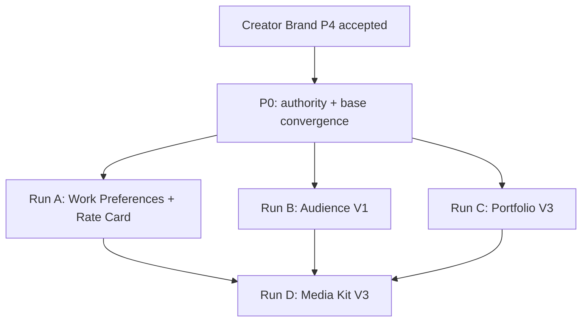

# Creator Centre multi-register current-state, dependency, and batching plan V1

`CREATOR_CENTRE_MULTI_REGISTER_CURRENT_STATE_DEPENDENCY_AND_BATCHING_PLAN_V1`

Date: 2026-09-15

## 0. Result and boundary

```text
RESULT =
READY_FOR_PARENT_REVIEW

IMPLEMENTATION =
NOT STARTED / NOT AUTHORIZED

SOURCE_BRANCHES =
NOT MUTATED

DATABASE / PROVIDER / DEPLOYMENT =
NOT MUTATED
```

The recommended batching is:

```text
COMBINE =
Commercial Setup / Work Preferences V2
+ Rate Card V2

KEEP SEPARATE =
Audience V1
Portfolio V3
Media Kit V3
```

The combined Commercial run must still preserve two Product contracts, two persistence/rollback boundaries, two acceptance results, and independently rejectable evidence bundles. Portfolio must be accepted before Media Kit consumes it. Media Kit remains the final cross-surface consumer.

This plan ends Media Kit authority at the `Work with Creator` CTA click. It does not define or implement the post-click route, signup, authentication, Brand verification, onboarding, Intelligence triggering, destination, C04 entry, or enquiry creation.

## 1. Operating authority and method

The operating wrapper was verified at:

- Repository: `Piyush1087/dummy_tcs`
- Path: `docs/ai-collaboration/creator-centre/orchestrator/CREATOR_TO_BRAND_CENTRE_SA_HANDOFF_PROTOCOL_V1.md`
- Publishing commit: `1c6da22386768d72025d77ea66bc63f01bbd4d59`

Authority remains:

- Parent: final Product authority and circuit-breaker adjudication.
- Creator Orchestrator: Creator Product and program orchestration.
- Brand Centre / Instagram Intelligence SA: technical architecture, implementation orchestration, and technical acceptance for Creator Instagram surfaces.
- External Local Codex: bounded local implementation and evidence runner, only after Git-published execution authorization.

The audit fetched exact refs, inspected remote branches rather than assuming `development`, reviewed the current Creator implementation base, and inspected shared Instagram, C04, Settings, public-access, and PDF surfaces. It did not change product code, schemas, migrations, provider configuration, databases, or deployment.

## 2. Exact Product authority and integrity

All supplied path-at-commit blob identities matched.

| Surface | Active authority | Commit | Expected/observed blob | Integrity |
|---|---|---|---|---|
| Audience V0 | `docs/ai-collaboration/creator-centre/CREATOR_INSIGHTS_AUDIENCE_V0_PRODUCT_DECISION_REGISTER.md` | `64bf4c454213277bb9fbe247e61bc78a203a227d` | `a3de78fd1641a018b20e364645215b70edf39171` | PASS |
| Content V0 | `docs/ai-collaboration/creator-centre/CREATOR_INSIGHTS_CONTENT_V0_PRODUCT_DECISION_REGISTER.md` | `acccc35a41a0f7a57f72b313114a8156d9245650` | `7f188254d96789f1a01baf0f42045b073c4a8a63` | PASS |
| Creator Brand V0 | `docs/ai-collaboration/creator-centre/CREATOR_BRAND_V0_PRODUCT_DECISION_REGISTER_V2.md` | `2d561da03ae5df296443f32f79f24264cc8a9361` | `a51e4b8d0351e26c1abcc5346bf7ef7ace0fd426` | PASS |
| Creator Brand Amendment 1 | `docs/ai-collaboration/creator-centre/CREATOR_BRAND_V0_PRODUCT_AMENDMENT_1_TAXONOMIES_AND_BOUNDS.md` | `07917b2191a6de3f0c8ffb86500abc597478fc2b` | `31f07f2049b6ac29794c7f37b2450d07e407c01d` | PASS |
| Audience V1 | `docs/ai-collaboration/creator-centre/CREATOR_INSIGHTS_AUDIENCE_V1_PRODUCT_DECISION_REGISTER_V2.md` | `27140fdf6cf522419146c3e7a147169b36a33e5e` | `b32f800dc976ca55a75d417ff9db7b807bf50ea6` | PASS |
| Portfolio V3 | `docs/ai-collaboration/creator-centre/CREATOR_PORTFOLIO_V0_PRODUCT_DECISION_REGISTER_V3.md` | `c84cd0b989eec40e12d659fc245aa8bc8dc43bd2` | `64eca5cebde271bca1e9cf0e1affd31d8db6c26d` | PASS |
| Work Preferences V2 | `docs/ai-collaboration/creator-centre/CREATOR_COMMERCIAL_SETUP_WORK_PREFERENCES_V0_PRODUCT_DECISION_REGISTER_V2.md` | `731dbd3bbfc6e35d0ff893894e9d1a70d218fb2a` | `bdd6a4764c9eb01196c1d6ffdc23d899ce61d9d0` | PASS |
| Rate Card V2 | `docs/ai-collaboration/creator-centre/CREATOR_COMMERCIAL_SETUP_RATE_CARD_V0_PRODUCT_DECISION_REGISTER_V2.md` | `275e8096a56d5331dc0fd091ccd2a29c03f89e9c` | `a338933279e2a3a23725465c3b06425635f16afe` | PASS |
| Media Kit V3 | `docs/ai-collaboration/creator-centre/CREATOR_MEDIA_KIT_V0_PRODUCT_DECISION_REGISTER_V3.md` | `d74184568d64155e0fab22739210805f954f01e6` | `414c32c014f0a1ac1a9416fff3770cc452fe93f8` | PASS |

The supplied supersession rules are accepted. Older Creator Brand, Audience V1, Portfolio, Work Preferences, Rate Card, and Media Kit registers are historical only. The Media Kit composition note is non-authoritative reference material.

## 3. Remote implementation status

### 3.1 Current branch evidence

| Surface | Backend | Frontend | Authority | Remote disposition |
|---|---|---|---|---|
| Audience V0 | `7028d1fcbd467175a5358fce92ad2edd63ea44cd` / tree `dbc9b8e00936d4ecbc700b516b17ad8ce78f2d17` | `4ca6141face77821f546a13bdde12c8c41780a6f` / tree `f14d5076021a97137f505a91c81736021a8dc30a` | `52917dfe2bbd7e92ceeb5ffcfe2b628fa49bd598` / tree `962ae60987d83fba313f81265faa3aa1f0163a50` | Product and technical acceptance declared by Parent; accepted implementation present. |
| Content V0 | `0fa145ac6a021337929e87b9eb9e0c67ebc82b7e` / tree `750065a56a4a060c125a9bee7ddc9fb842204e7e` | `7edd26d3cdad0ec84083884b34039952368a1295` / tree `0cc596ca1ef1d1c4a51857125547de156e487c8b` | `cb9ee23118eafb2dc156c25eb09702ea93252db4` / tree `26c1598ed4a90ecef5d0d1c14145945a5a7304aa` | Corrected implementation is published and inherited by Creator Brand. The corrected ledger still says `AWAITING_CHILD_SA_REVIEW`; Parent's V2 assignment declares Content technically accepted. Canonicalize this documentary mismatch in the next execution P0; do not replay Content. |
| Creator Brand V0 | `6206f43c6a13c304c971b810e1dd99a20aaaa11f` / tree `533f543612b856cfaf3b57769fe0b5541b803c3f` | `c505c0679e39effdd9608e319112591d5ae4c079` / tree `18dd8ed798aae509baa7d0d51ab8e31d7ac2dbbd` | `08c72433b32ed8a199d29ae8875d668dc2f0eddf` / tree `d9decab31d9bee7251bbbf675af95a29dafd08c9` | P0–P3 accepted; P4 evidence is published and ready, but the Git ledger records P4 as awaiting Technical-SA review. Final acceptance must be Git-canonicalized before a dependent run starts. |
| Audience V1 | none | none | Product register on `main` only | Product frozen; implementation not started. |
| Portfolio V3 | none | none | Product register on `main` only | Product frozen; implementation not started. |
| Work Preferences V2 | none | none | Product register on `main` only | Product frozen; implementation not started. |
| Rate Card V2 | none | none | Product register on `main` only | Product frozen; implementation not started. |
| Media Kit V3 | no V3 branch | no V3 branch | Product register on `main` only | Product frozen; V3 implementation not started. Legacy backend/public endpoints remain mounted; the current frontend `/creator/media-kit` redirects to Creator Home. |

No future-register implementation branch was found. None of the Creator Audience, Content, or Brand implementation branches is merged into backend/frontend `development`.

### 3.2 Canonical planning and implementation bases

The smallest current implementation base containing Audience, corrected Content, Creator Brand, and accepted Instagram foundations is:

```text
BACKEND_BASE =
6206f43c6a13c304c971b810e1dd99a20aaaa11f
tree 533f543612b856cfaf3b57769fe0b5541b803c3f

FRONTEND_BASE =
c505c0679e39effdd9608e319112591d5ae4c079
tree 18dd8ed798aae509baa7d0d51ab8e31d7ac2dbbd

IMPLEMENTED_AUTHORITY_LINEAGE =
08c72433b32ed8a199d29ae8875d668dc2f0eddf
tree d9decab31d9bee7251bbbf675af95a29dafd08c9

LATEST_PRODUCT_PLANNING_LINEAGE =
3415a8b7ef155e115b77da3335795ff8ab05de3f
tree 271ee57776f87970eebb1d014d3fac188ce01fac
```

Before implementation, an authorized P0 must preserve both authority histories through an ordinary non-force convergence commit after Creator Brand P4 is accepted. It must not flatten, replace, or infer that `main` or `development` alone is the implementation base.

Database baseline on the Creator Brand backend:

```text
MIGRATIONS = 102
HEAD = 20260915100000_creator_brand_canonical_profile_revision
HEAD_MIGRATION_SHA256 = ec6484427c24d5755549ff9e71bae989f5ff592a6fc5da953ca07494b8744452
```

## 4. Current-state and reuse matrix

| Surface | Backend / persistence | Frontend / shell | Shared Intelligence | C04 | Settings / external owners | Net delta |
|---|---|---|---|---|---|---|
| Audience V1 | Reuse `creator-audience`, strict consumer, owner-scoped Evidence/generation/current, and Content/Brand readers. Historical-comparability projection needs proof. | Upgrade the existing Audience section in the Creator Insights shell; do not add a new top-level workspace. | Reuse current preservation, timestamps, coverage, deterministic finalizers, and shared current. Do not add an LLM requirement. | N/A | Settings remains source lifecycle owner. Media Kit separately owns public/Brand projection. | New V1 contracts/calculators/history projection and UI. Schema is not expected unless current retained generations cannot support compatible-series queries. |
| Portfolio V3 | No canonical Portfolio aggregate exists. Reuse Instagram media identity, C3 `likely_collab`, source Evidence, Content facts, and secure media primitives. Add Portfolio item/provenance/selection/removal persistence. | New Portfolio route and Creator shell item; static cover/source-link behavior; no player/upload. | Instagram Intelligence remains discovery authority. `likely_collab` cannot become canonical Collaboration truth. Uninspected/unsupported remains unknown. | Reuse completed Collaboration, approved submission, publishing Evidence and `verifiedAt` as inputs. Add a read-only Portfolio projection adapter and exact C04-to-media/work-reference identity rules. | Settings owns Instagram and platform-data lifecycle. Creator removal is Portfolio curation, not source deletion. | New feature, additive schema, source adapters, curation API/UI, dedupe/provenance. Story support is capability-gated. |
| Work Preferences V2 | No canonical feature exists. Reuse Creator Brand's manual aggregate/revision/CAS/audit pattern and Team actor context, without creating a generic profile engine. | New Commercial Setup shell/section with source-independent editing. | N/A; no Intelligence prerequisite. | Read payout-readiness gate only where Product requires; do not own it. | Settings owns shipping address, legal/payout setup and Team roles. C06 provides payout readiness. | New canonical preferences aggregate, API, policy actions and UI. |
| Rate Card V2 | No canonical feature exists. Reuse manual revision/CAS/idempotency pattern. Keep atomic rates separate from Work Preferences. | Sibling section under Commercial Setup; shared navigation/form primitives. | N/A. | Campaign/Add Brief remains transactional commercial truth and usage-rights/deliverable vocabulary authority. | Country/currency source must be resolved from canonical Creator/Settings/legal authority; no manual FX. | New rate aggregate, API, policy actions and UI. Separate persistence and migration from Work Preferences even within one run. |
| Media Kit V3 | Current V3 aggregate does not exist. Legacy mounted `creator-centre` and public Media Kit APIs serialize `UserProfile` caches, themes, arbitrary rate fields, and `CreatorProfile.isMediaKitPublic`; these are not V3 authority. | Current `/creator/media-kit` route redirects to Creator Home. Legacy profile workspace remains source code but is not mounted. | Consume accepted projections only; never expose private Evidence/confidence/readiness. | No downstream CTA planning. C04 contributes only accepted Portfolio provenance before composition. | Brand verification owns verified-view admission. Settings owns email. PDF is a presentation export, not a commercial lock. | New composition/lifecycle/publish/public/verified/PDF contracts and UI; safe legacy compatibility/cutover required. |

## 5. Shared infrastructure findings

### 5.1 Reusable foundations

- Typed Creator owner scope over the shared DE/Evidence/Intelligence runtime.
- Stable Instagram Resource/Capture/Evidence identities, authorization-generation fencing, source/current preservation, and target-only purge primitives.
- C2 deterministic metrics and C3 per-media semantics including evidence-backed `likely_collab`.
- Current Creator Audience, Content, and Brand consumer/API patterns.
- One Creator Team actor-context policy with explicit read/edit actions; new actions should extend this vocabulary rather than infer rights from unrelated settings.
- One Creator shell, sidebar/mobile drawer, five-item bottom navigation, strict parsers, authenticated fetch, last-good UI recovery, responsive and Axe harnesses.
- Creator Brand's manual-first revision/CAS/idempotency/audit pattern is a good domain pattern for Work Preferences and Rate Card, but not a reason to merge their ownership.
- Existing frontend `jsPDF`/`jspdf-autotable` and printable-document utilities can be evaluated as donors for Media Kit PDF. They do not by themselves satisfy V3 authorization, image safety, point-in-time provenance, or browser-memory constraints.

### 5.2 Gaps and constraints

1. **Creator Brand acceptance record:** P4 is evidence-ready but not Git-recorded as accepted. This blocks dependent implementation authorization, not this planning report.
2. **Content documentary mismatch:** corrected code is inherited and Parent declares acceptance, but the corrected Content ledger still awaits review. Canonicalize without replaying implementation.
3. **Story capability:** no accepted Story inventory/Evidence/identity/rendering path was found. Existing provider contracts cover persistent posts, Reels/video, carousel children, permalinks, and bounded temporary cover/media acquisition. Story availability, 24-hour capture, link destination, permissions, expiry and retention must be verified before Story Portfolio support. Unsupported Story capability must remain absent/unknown and must not block supported Portfolio item types.
4. **Static media presentation:** provider media/thumbnail URLs are acquired through secure temporary paths and are not durable assets. Portfolio/Media Kit need an authorized bounded derivative/cover contract or an exact safe source-link-only fallback. Ephemeral provider URLs cannot be persisted as stable presentation truth.
5. **C04 projection:** C04 records deliverable execution, submission asset refs, publishing Evidence, compliance verification and Collaboration completion. It does not expose a Portfolio-specific read model or guaranteed Instagram media identity. A bounded adapter must prove exact work/media identity and keep Creator Shop verification distinct from Instagram verification.
6. **Creator Settings deletion:** Creator Settings owns disconnect/reconnect. Internal Creator-Instagram purge exists, but no user-facing Creator source/platform-data delete endpoint is present. Portfolio must not invent it. Any separately authorized Settings build must define source deletion versus retained extracted/confirmed outputs.
7. **Verified Brand admission:** canonical Brand verification exists, but Media Kit needs a specific read-only verified-view admission contract binding authenticated Brand actor, verified Brand profile/organization and privacy-safe Creator projection. Media Kit must not implement Brand verification.
8. **Legacy Media Kit:** backend and public APIs remain mounted while the frontend route redirects. Legacy `isMediaKitPublic`, cached metrics, theme/rate controls and public serializer conflict with V3. V3 needs a fail-closed compatibility and cutover plan; no destructive removal without usage proof.
9. **Currency:** Rate Card needs one canonical country-to-currency decision and exception policy from current Creator/Settings/legal authority. No FX or viewer-currency conversion is authorized.

## 6. Dependency DAG



Runs A, B, and C are technically parallel after P0. If one mechanical relay is used, start Run C's provider/C04 preflight early because it contains the greatest external uncertainty; implementation order among A/B/C does not change ownership. Run D begins only after all included source surfaces are separately accepted.

## 7. Batching recommendation

### 7.1 Run A — combine Work Preferences V2 and Rate Card V2

**Why combine:** both live in Commercial Setup, reuse manual-first mutation, Creator Team policy, country/currency context, shell/navigation, form/accessibility primitives, and final browser matrices. Splitting them would duplicate the same setup and convergence work.

**Why keep internal boundaries:** Work Preferences owns availability/readiness/preferences; Rate Card owns atomic starting-from presentation. Campaign/Add Brief owns transactional terms. The combined run therefore uses separate contracts, tables/aggregates, migrations, APIs, commits, tests, evidence artifacts and acceptance decisions.

**Explicit exclusions:** KYC implementation, Settings address/bank mutation, payout execution, Campaign quote/agreement mutation, packages, FX, eligibility, ranking, Intelligence generation.

**Expected architecture delta:** two canonical manual aggregates with immutable revisions/CAS/idempotency/audit; explicit role actions; one Commercial Setup frontend family; read-only projections from Settings/C06; canonical country/currency resolver.

### 7.2 Run B — Audience V1 separately

**Why separate:** it is a deterministic Intelligence upgrade with historical comparability, coverage and cross-surface read inputs. It shares little mutation/schema work with commercial setup and should not be coupled to Portfolio provider/C04 uncertainty.

**Explicit exclusions:** persona, demographic joins, causal response, recommendations, Creator Brand mutation, Media Kit controls, source lifecycle actions.

**Expected architecture delta:** versioned Audience V1 Object/consumer contracts, compatible-series resolver, deterministic Highlights/context/change calculators and in-place frontend upgrade. Default expectation is no schema migration; inability to query retained comparable generations without a schema change returns for bounded review.

### 7.3 Run C — Portfolio V3 separately

**Why separate:** Portfolio combines inference, manual curation, C04 verified evidence, media identity, provider capability, removal semantics and privacy. It is the highest-risk producer and needs its own circuit breakers and rollback.

**Explicit exclusions:** projects, performance-ranked admission, manual media upload, scraping arbitrary links, internal video player, canonical Collaboration promotion, Media Kit publishing, downstream CTA journey.

**Expected architecture delta:** Portfolio aggregate/items, multi-provenance links, curation/removal state, deterministic dedupe, Instagram discovery adapter, C04 completed-work adapter, creator-added external-link validation, static cover/source projection and new frontend workspace.

### 7.4 Run D — Media Kit V3 separately and last

**Why separate:** it is a public/verified cross-surface privacy boundary, lifecycle/publishing system, stable public projection and PDF exporter. Combining it with Portfolio would let Portfolio failures hide behind composition success and would create one oversized security acceptance surface.

**Explicit exclusions:** all mechanics after `Work with Creator` click; enquiry creation; C04 entry; Brand signup/auth/verification/onboarding; Intelligence triggers; agency support; public PDF; commercial quote/agreement/lock; country/preference/rate/availability filtering.

**Expected architecture delta:** Media Kit DRAFT/LIVE aggregate, source inclusion settings, ordered Portfolio selection, stable slug/public projection, verified-Brand projection, Settings-owned email projection, boundary-only CTA telemetry, on-demand point-in-time PDF, and controlled legacy API/data cutover.

### 7.5 Rejected batching candidates

| Candidate | Decision | Reason |
|---|---|---|
| Portfolio + Media Kit | Do not combine into one implementation run | Producer-before-consumer, Story/C04/media uncertainty, legacy public API migration, verified-view privacy and PDF create independent failure domains. Share contracts, not acceptance. |
| Audience V1 + Media Kit | Do not combine | Media Kit must consume an already accepted Audience projection; Audience change semantics must be independently testable. |
| Audience V1 + Portfolio | Do not combine | Different truth models: longitudinal deterministic Intelligence versus curated multi-provenance items. Limited shared shell work does not offset risk. |
| Creator Brand reopening with any run | Do not combine | Creator Brand Product is frozen and implementation is evidence-ready. Only acceptance canonicalization is pending; no implementation replay or redesign. |

## 8. Finite runner-packet plans

These are planning packets only. Exact prompts, branches and authorization must be Git-published later.

### 8.1 Shared P0 — authority and execution-base convergence

1. Verify exact Product blobs, accepted implementation SHAs/trees, remote equality, clean worktrees and migration 102 identity.
2. Obtain/record final Creator Brand P4 acceptance and canonicalize the corrected Content acceptance wording without replaying implementation.
3. Normally merge latest Product planning authority with the accepted implemented authority lineage; prove both ancestors and exact tree.
4. Freeze executable contracts, route ownership, new Team actions, legacy Media Kit disposition and per-run migration namespaces.
5. Publish a single multi-register execution ledger that links, but does not replace, each register's own evidence ledger.

Stop on ancestry mismatch, dirty overlapping work, unaccepted Creator Brand P4, or a Product-contract conflict.

### 8.2 Run A packets — combined Commercial Setup

- **A0 Contracts and external projections:** freeze separate Work Preferences and Rate Card DTOs/actions, country/currency authority, Settings/C06 read projections, Campaign vocabulary, idempotency and audit contracts.
- **A1 Work Preferences persistence/API:** additive model/revision migration; Owner/Manager edit, Assistant read; initial `ACCEPTING`; availability/date, industries and barter/UGC boundaries; source-independent behavior.
- **A2 Rate Card persistence/API:** separate additive model/revision migration; atomic starting-from rates, `<15 s` Reel reference, Partnership Ads, usage-rights and payment terms; country currency; no transactional locking.
- **A3 Shared Commercial Setup frontend:** desktop/mobile route and sections, independent loading/errors/last-good state, role behavior and canonical Settings links.
- **A4 Integrated closeout:** clean migration and populated upgrade, API/browser widths, keyboard/Axe, cross-domain non-mutation, independent Work Preferences and Rate Card acceptance artifacts plus combined developer handoff.

### 8.3 Run B packets — Audience V1

- **B0 Executable V1 contract/history preflight:** map V0 current and retained generations; freeze compatible denominator/source/account/cohort/metric series rules and explicit breaks.
- **B1 Deterministic backend:** implement Overview, Highlights, cohort profiles, 0–2 Audience/Content context observations, and change only when comparable; reuse current-preservation and owner scope.
- **B2 Consumer/frontend upgrade:** replace V0 view in place; preserve whole-cohort selector, partial/unknown states, source/freshness and role read policy.
- **B3 Integrated closeout:** fixture/provider-neutral PostgreSQL lineage, history discontinuities, no cross-join/causality, failure-current, tenant/account isolation, full responsive/accessibility and V0 regression.

### 8.4 Run C packets — Portfolio V3

- **C0 Capability and identity freeze:** prove persistent-post/Reel/carousel identities, source links and safe covers; verify Story capability separately; freeze C04 completed/publishing Evidence projection and creator-added link rules.
- **C1 Canonical persistence:** additive Portfolio item, provenance-link, curation/removal and ordering schema; deterministic Instagram+C04 dedupe; no source deletion cascade.
- **C2 Producer adapters/API:** Instagram possible-collab shortlist; C04 verified work; creator link addition; remove/restore; role/tenant/source isolation; static cover/source projection.
- **C3 Frontend:** individual-item workspace, provenance labels, curation controls, capability-aware empty/partial states, no upload/player/project abstraction.
- **C4 Integrated closeout:** clean and populated migration, exact identity/dedupe, source disconnect/delete behavior, C04 completion/UGC fixtures, supported media links, responsive/Axe/browser and separate Story disposition.

### 8.5 Run D packets — Media Kit V3

- **D0 Legacy and security convergence:** inventory mounted legacy APIs/data/callers; freeze safe migration/cutover, DRAFT default, stable slug, verified-Brand admission and data-minimization contracts.
- **D1 Canonical composition/lifecycle:** additive Media Kit lifecycle and inclusion/order persistence; compose accepted Brand/Audience/Content/Portfolio/Commercial sources without copying their truth.
- **D2 Public and verified projections:** unlisted/noindex public shell; verified-Brand layer; Settings email reveal; availability only for verified Brand; CTA telemetry ending exactly at click.
- **D3 PDF:** on-demand point-in-time verified presentation with generated-at/source-as-of dates, safe static media/links, no persistent hosted archive, and bounded failure that does not change LIVE state.
- **D4 Frontend/preview:** Creator DRAFT/LIVE editor, public/verified preview modes, responsive pages, no arbitrary themes or stale legacy controls.
- **D5 Integrated closeout:** migration/default-public safety, anonymous/public/verified/Creator authorization matrix, cross-tenant privacy, source stale/partial handling, PDF security/accessibility, legacy-route cutover and no downstream CTA traffic.

## 9. Separate acceptance gates and evidence

### Audience V1

- Exact V0/Content/Creator Brand inputs and owner scope.
- Deterministic arithmetic, denominator compatibility and explicit series breaks.
- No persona, demographic join, causal claim or recommendation.
- Current preservation and truthful partial/stale/unavailable states.
- Owner/Manager/Assistant read-only, Settings lifecycle unchanged.
- Dedicated `AUDIENCE_V1_*` evidence, ledger outcome and developer handoff.

### Work Preferences V2

- Manual setup without Instagram/Intelligence.
- Exact availability/default/date and preference bounds.
- Settings/C06 readiness is projection only.
- Owner/Manager mutate; Assistant read; immutable actor audit.
- Dedicated migration, rollback proof, evidence and outcome independent of Rate Card.

### Rate Card V2

- Exact atomic items, `Starting from`, `<15 s`, Partnership Ads, UGC/rights/payment semantics.
- Canonical country-based currency; no manual FX.
- No Campaign/Add Brief transactional mutation.
- Dedicated migration, rollback proof, evidence and outcome independent of Work Preferences.

### Portfolio V3

- Individual item identity, not projects; no performance admission.
- Exact distinct provenance and deterministic dedupe.
- Remove/restore does not delete source/C04 truth.
- Creator-added links are validated; no upload/scrape/player.
- Story is accepted only with proven provider capability and truthful expiry/destination; otherwise explicitly capability-gated.
- Target-only Settings lifecycle and cross-tenant preservation.
- Dedicated Portfolio evidence, ledger and handoff before Media Kit consumption.

### Media Kit V3

- DRAFT by default; one stable link; unlisted/noindex; no accidental legacy publication.
- Public and verified-Brand projections are distinct and field-minimized.
- Portfolio selection/order, coarse Audience/Content visibility, Rate Card inclusion and Settings email ownership.
- Availability only in verified view and never an access/CTA filter.
- PDF is on demand, point-in-time, access-controlled and non-transactional.
- `Work with Creator` instrumentation proves click only; no downstream route or event is planned or emitted.
- Separate Media Kit evidence, privacy/security report, legacy cutover proof and handoff.

Every packet also requires changed-surface tests, clean PostgreSQL proof where persistence changes, production builds, scoped lint/format/diff integrity, secret/forbidden-artifact scan, normal non-force publication, independent fetch-back equality, and clean worktrees. Full cross-surface and browser matrices belong at each register's acceptance gate, not every internal packet.

## 10. Circuit breakers and unresolved questions

### Mandatory circuit breakers before or during execution

1. Creator Brand P4 cannot be formally accepted from its published evidence.
2. Product and implemented authority histories cannot be normally converged with both ancestors preserved.
3. A run requires replacing the shared owner-scoped DE/Evidence/current runtime, a second scheduler, synthetic Brand identity, or weakened tenant/account/generation isolation.
4. Story support requires new provider permissions/OAuth mutation or cannot prove exact Creator/media/time/link semantics. Defer Story only; do not fabricate it.
5. C04 cannot provide exact completed-work/verified Evidence sufficient for Portfolio provenance without changing C04 ownership.
6. Country/currency sources conflict or require FX/viewer-currency behavior not frozen by Product.
7. Media Kit verified-view admission cannot bind to canonical verified Brand identity without changing Brand verification Product.
8. Legacy public Media Kit state cannot be migrated to fail-closed DRAFT without ambiguous public exposure or destructive backfill.
9. PDF or static-cover implementation would persist provider locators/raw media, fetch unbounded remote content, expose private fields, or require a new system-wide runtime.
10. Any implementation crosses the `Work with Creator` click boundary.

### Questions requiring bounded technical verification, not new Product answers

- Does the retained Intelligence generation history support every Audience V1 compatible-series query without a schema/index addition?
- Which exact C04 Evidence metadata can deterministically bind a verified deliverable to an Instagram media ID, and what is the truthful UGC-only work destination when no creator-published permalink exists?
- Which existing canonical Creator country source is authoritative for Rate Card currency when profile, shipping and legal locations differ? If Product authority does not already choose, return to Parent.
- Can current Brand verification provide the required Media Kit viewer assertion without a new Brand onboarding flow?
- Which legacy Media Kit callers/data require compatibility reads during V3 cutover, and are any profiles currently public by legacy default?
- Can Media Kit PDF safely reuse client-side `jsPDF` while preserving access control, bounded media, Unicode, deterministic point-in-time content and no durable export? If not, return with a narrowly scoped runtime choice.

## 11. Rollback and isolation approach

- Use one branch family and one immutable ledger per implementation run. Do not implement on `development`.
- Pin backend/frontend/authority SHA and tree at every run start. Use normal merges and non-force pushes only.
- Give each canonical aggregate its own additive migration and rollback/forward-repair notes. In the combined Commercial run, Work Preferences and Rate Card migrations remain separate and can be accepted or rejected independently.
- Use feature/route activation only after populated-upgrade and role/privacy gates pass. Do not backfill guessed values.
- Portfolio stores curation/provenance links and tombstones; it does not cascade-delete Instagram or C04 truth.
- Media Kit begins fail-closed as DRAFT. Preserve legacy storage until caller/public-state inventory is proven; cut over reads before retiring writes. Any old `isMediaKitPublic=true` state must not silently become V3 LIVE.
- A failed consumer projection preserves canonical producer truth and the last valid published state where Product authorizes it; it never publishes empty/zero replacements.
- One register's failed acceptance prevents only its dependent edges. Run A, B, and C failures do not conceal each other; Media Kit waits for every selected producer.

## 12. Final recommendation and next authority

```text
RECOMMENDED_RUNS =
P0 — authority/base convergence
Run A — Work Preferences V2 + Rate Card V2 (combined, separately accepted)
Run B — Audience V1 (separate)
Run C — Portfolio V3 (separate)
Run D — Media Kit V3 (separate and final)

MEDIA_KIT_WORK_WITH_CREATOR_BOUNDARY =
ENDS AT CTA CLICK

POST_CLICK_JOURNEY =
EXCLUDED

IMPLEMENTATION_UNDER_THIS_ASSIGNMENT =
NOT STARTED
```

Parent and Creator Orchestrator must first review this recommendation, resolve/canonicalize Creator Brand P4 acceptance and the Content ledger wording, and publish explicit Git execution authority. No chat message, local note, inferred urgency, branch existence, or this planning artifact authorizes implementation.
