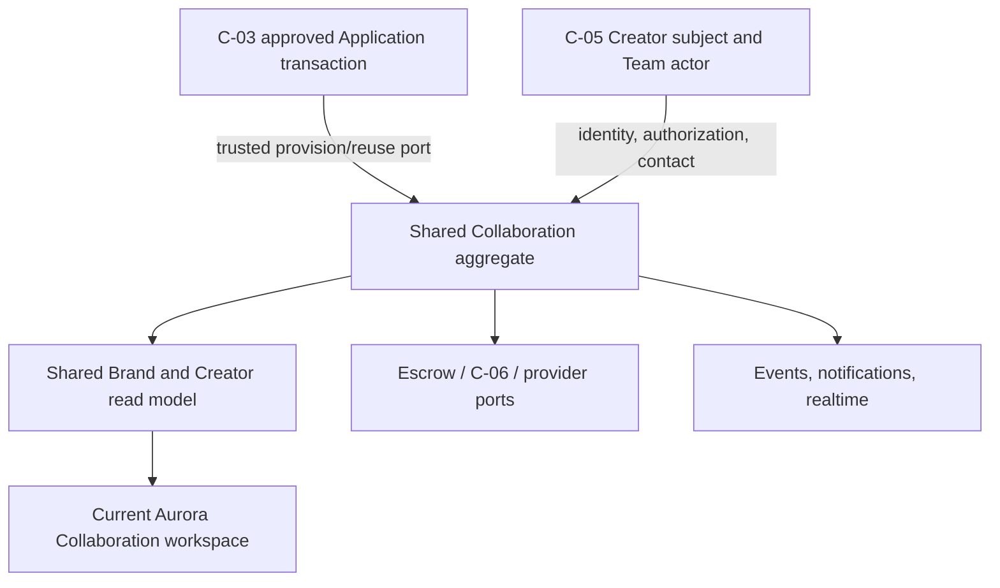

# C-04 Architecture Freeze V1

`C04_ARCHITECTURE_FREEZE_V1`

Date: 2026-09-04
Status: **ACCEPTED**
Product: `C04_PRODUCT_LOGIC = FROZEN`
Implementation: **NOT AUTHORIZED**

## 1. Architecture objective

Extend the accepted shared Brand + Creator Collaboration architecture so the Creator experience:

- is owned by the canonical C-05 Creator subject and operated by authorized Team actors;
- starts NEGOTIABLE commercial execution with a first C-04 Creator proposal;
- confirms an immutable, one-Collaboration delivery destination before physical dispatch;
- preserves every already-frozen Brand/shared lifecycle and financial behavior;
- reuses the current shared frontend, C-05 shell, Phase G state evidence, and Aurora;
- consumes C-03/C-05/C-06 and provider boundaries without duplicating their data or engines.

## 2. Non-goals

C-04 does not create or own:

- a Creator-only Collaboration aggregate/lifecycle/table family;
- Application submission, approval, snapshot, or proposal collection;
- Creator Team membership or reusable profile/contact/default-address management;
- payout destination management, KYC, AML, Tax, beneficiary verification, or disbursement;
- a second Brand Escrow, Payout, Notifications, Conversation, media, or provider system;
- Creator Marketplace;
- a new Trust/rating/rights-management product;
- client-authored workflow state;
- new Stitch output without a later specific visual-gap finding.

## 3. Authority dependencies

| Dependency | Architecture use | Gate |
|---|---|---|
| Shared Collaboration contracts | Aggregate, five-stage workflow, lifecycle, commands, read model, financial resolution, chat/events/realtime | Frozen |
| C-03 backend | Same-transaction provision/reuse, immutable Application snapshot, unique source lineage, no proposal | Hard backend implementation gate; post-P1.4 accepted SHA in progress |
| C-03 frontend | Creator Application→Collaboration navigation/re-entry integration base | Separate frontend implementation gate; C-03 Systems Architect-approved immutable SHA in progress |
| C-05 runtime | Subject/workspace/Team actor, shell, provider state, contact/address, legal/payout destination | Accepted |
| C-06 / Escrow / Payout | Beneficiary/KYC/AML/Tax, provider execution and webhook authentication, payout/disbursement/refund execution | External owner; live availability is not a C-04 MVP dependency |
| Current frontend + Phase G + Aurora | Shared workspace, responsive states, recovery, component reuse | Reuse authority after Product/state contracts |

## 4. High-level architecture



The Collaboration aggregate remains the only workflow authority. C-05 and C-03 are upstream identity/source owners. External financial/provider systems execute effects and return authoritative confirmations.

## 5. Canonical aggregate changes

### 5.1 Collaboration identity

New canonical rows persist:

```text
sourceApplicationId      required and unique
creatorProfileId         required canonical subject
creatorWorkspaceId       required authorization/notification scope
brandProfileId           existing Brand party
campaignId               non-unique with Creator subject
campaignAssetId
briefId
```

Compatibility `creatorUserId` may remain nullable/retained during migration but is not used to authorize a new canonical Creator request.

Required database invariant for new canonical rows:

```text
sourceApplicationId IS NOT NULL
→ creatorProfileId IS NOT NULL
  AND creatorWorkspaceId IS NOT NULL
  AND execution snapshot exists before commit
```

### 5.2 Commercial agreement

Add/freeze:

```text
CollaborationNegotiationState.AWAITING_CREATOR_PROPOSAL
creatorProposedFee
creatorProposalSubmittedAt
minimumCreatorFeeSnapshot
```

`applicationProposedFee` is not populated for new C-03-sourced rows. Historical exact values may be mapped into compatibility or migrated into `creatorProposedFee` only with verified provenance.

### 5.3 Creator Team actor audit

`CollaborationEvent` gains nullable actor snapshot fields where absent:

```text
actorMembershipId
actorRole
actorWorkspaceId
actorOrganizationId
subjectCreatorProfileId
```

`CollaborationMessage` retains:

```text
senderUserId
senderMembershipId
senderRole
senderWorkspaceId
subjectCreatorProfileId
```

State-changing leaf rows may continue storing `submittedByUserId`/`reviewedByUserId`; the canonical command audit is the immutable event at the corresponding aggregate version. Sensitive names, addresses, snapshots, or credentials are not copied into event payloads.

### 5.4 Physical delivery destination

Introduce one Collaboration-owned immutable execution record:

```text
CollaborationDeliveryDestination
  id
  collaborationId              UNIQUE
  schemaVersion
  sourceType                   C05_DEFAULT | COLLABORATION_OVERRIDE
  sourceContactId              nullable for override
  sourceContactUpdatedAt       nullable for override
  recipientName
  addressLine1
  addressLine2
  city
  stateRegion
  postalCode
  countryCode
  phoneCountryCallingCode      nullable
  phoneNationalNumber          nullable
  phoneE164                    nullable
  deliveryInstructions         nullable
  destinationContentHash
  confirmedByUserId
  confirmedByMembershipId
  confirmedByRole              OWNER | MANAGER
  confirmedAt
  createdAt
```

The record is append-prohibited by ordinary runtime after creation: no ordinary update/delete command. Idempotent replay of the same command returns the existing result; a semantically different second confirmation fails with a stable conflict. This avoids inventing an unfrozen post-confirmation edit workflow.

Full address fields remain structured to support dispatch. They are never placed in event/notification/realtime/log/analytics payloads. Events reference only destination ID, source type, schema version, and content hash.

### 5.5 Fulfillment destination state

The read/domain projection includes:

```text
NOT_APPLICABLE
AWAITING_CREATOR_CONFIRMATION
CONFIRMED
```

The state is deterministically derived from immutable `physicalDeliveryRequired` in the execution snapshot plus existence of the one-to-one destination record. It is not stored as a second mutable fulfillment-state column. This avoids drift and does not create a new top-level Collaboration stage.

## 6. Provisioning architecture

### 6.1 Trusted port

C-04 fulfills the C-03 `ApprovedApplicationCollaborationPort` inside the caller transaction. The port is not an HTTP endpoint and is not callable with a client-assembled snapshot.

### 6.2 Provisioning algorithm

```text
receive tx + applicationId + approvalTransitionId
→ load locked APPROVED transition candidate and immutable Application snapshot
→ validate subject/workspace/Brand/Campaign/Asset/Brief lineage
→ find Collaboration by sourceApplicationId
   → found: verify invariant-equivalent lineage; return created=false
   → absent: initialize aggregate, snapshot, commercial, fulfillment,
             Deliverable executions, publishing applicability and creation event
→ return collaborationId + created=true
```

The C-03 caller owns transaction order and final commit. C-04 cannot create a canonical Collaboration through a second public “create thread” path.

### 6.3 Initial state

| Snapshot mode | Commercial state | Stage result |
|---|---|---|
| FIXED | `creatorProposedFee=null`, agreed fee=fixed amount, `LOCKED`/`NOT_REQUIRED` | advance to Securement under canonical progression |
| NEGOTIABLE | proposed/counter/agreed null, `AWAITING_CREATOR_PROPOSAL` | remain Negotiation, action required by Creator |

If physical Brand Support is required, fulfillment will later project `AWAITING_CREATOR_CONFIRMATION` when Fulfillment becomes active. It does not block Negotiation or Securement.

## 7. Creator authorization architecture

### 7.1 Query authorization

1. Resolve `CreatorWorkspaceActorContext` through the C-05 service.
2. Match its `subjectCreatorProfileId` and `workspaceId` to the Collaboration.
3. Require active membership and non-enumerating not-found behavior on mismatch.
4. Permit Owner, Manager, and Assistant to list/read/history/chat.
5. Do not require current Instagram usability for existing Collaboration access.

### 7.2 Command authorization

```text
availableActions =
  shared-domain state-valid actions
  ∩ actor-class actions
  ∩ C-04 Team-role actions
  ∩ current prerequisite/capability guards
```

Owner and Manager receive state-changing Creator actions. Assistant receives none. All commands repeat authorization server-side; frontend control visibility is not security.

### 7.3 Membership races

Actor resolution occurs inside or immediately before the command transaction and is revalidated under the same authoritative database state used for the command. A stale session/member removal or role downgrade fails without state mutation. Optimistic aggregate version and command idempotency continue to protect concurrent Team actions.

## 8. Command architecture

### 8.1 New command: `SubmitCreatorProposal`

Route contract:

```text
POST /api/v1/collaboration/threads/:collaborationId/negotiation/proposal
```

Payload:

```text
commandId
expectedAggregateVersion
proposedCreatorFee
```

Server guards:

- canonical active Collaboration;
- stage `NEGOTIATION`;
- state `AWAITING_CREATOR_PROPOSAL`;
- actor Owner/Manager for the matching Creator subject/workspace;
- amount is a valid currency decimal, in locked currency, and not below `minimumCreatorFeeSnapshot`;
- proposal not already supplied;
- command idempotency and aggregate-version match.

Atomic effect:

```text
creatorProposedFee = input
creatorProposalSubmittedAt = now
negotiationState = AWAITING_BRAND_DECISION
aggregateVersion += 1
append CollaborationEvent
optionally project SYSTEM message
enqueue/invalidate projections after commit
```

### 8.2 New command: `ConfirmPhysicalDeliveryDestination`

Route contract:

```text
POST /api/v1/collaboration/threads/:collaborationId/fulfillment/delivery-destination/confirm
```

Payload alternatives:

```text
DEFAULT:
  commandId
  expectedAggregateVersion
  sourceType = C05_DEFAULT
  sourceContactId
  expectedSourceUpdatedAt

OVERRIDE:
  commandId
  expectedAggregateVersion
  sourceType = COLLABORATION_OVERRIDE
  structuredDestination
```

Server guards:

- physical fulfillment is required and current;
- destination not already confirmed;
- Owner/Manager matching Creator subject/workspace;
- default source is reloaded from C-05 and matches ID/version;
- C-05 legacy unstructured phone state is not silently copied as a structured phone;
- override validates the canonical structured address/contact schema;
- required address fields are present;
- command idempotency and aggregate-version match.

Atomic effect:

- create immutable destination;
- append actor-attributed event with non-sensitive metadata;
- increment aggregate version;
- make Brand `ProvideFulfillment` available only if every other guard passes.

The command never updates C-05.

### 8.3 Existing Creator commands

Existing shared commands are retained. Their domain guards are unchanged; authorization is adapted to Owner/Manager and subject/workspace identity:

- `AcceptCounterOffer`, `DeclineNegotiation`;
- `ConfirmFulfillment`, `ReportFulfillmentIssue`;
- `SubmitDeliverable`;
- `SubmitPublishingEvidence`, `SubmitCorrectedPublishingEvidence`;
- `CancelCollaborationByCreator`;
- `SubmitCollaborationFeedback`.

`PostCollaborationMessage` is allowed to Assistant as communication, including terminal residual coordination under frozen shared authority.

## 9. Brand action preservation

Brand action semantics remain unchanged. In particular:

- Brand accepts the Creator proposal or counters once;
- Brand secures the full commercial reserve;
- Brand provides/remediates fulfillment;
- Brand reviews each Deliverable with the frozen two-revision limit;
- SYSTEM auto-approval never authorizes publishing;
- Brand explicitly authorizes/declines publishing after SYSTEM auto-approval;
- Brand verifies or requests correction of publishing evidence;
- Brand end/resolution and settlement semantics remain frozen.

The only new Brand prerequisite is: physical `ProvideFulfillment`/dispatch is unavailable before destination confirmation.

## 10. Read model architecture

### 10.1 Detail additions

```text
identity.creatorProfileId
identity.creatorWorkspaceId
viewer.actorRole                 Creator view only
commercial.creatorProposedFee
commercial.minimumCreatorFee
fulfillment.physicalDeliveryRequired
fulfillment.deliveryDestinationState
fulfillment.deliveryDestination  authorized projection only
workflow.availableActions
```

`availableActions` adds:

```text
SubmitCreatorProposal
ConfirmPhysicalDeliveryDestination
```

Assistant sees state and history but neither action. Brand sees a confirmed physical destination only when needed for dispatch; before confirmation it sees a waiting state, not the mutable C-05 default. Creator Owner/Manager may read the full confirmed execution copy. Assistant receives confirmation status and a non-sensitive summary only, not the full address/phone body.

### 10.2 Context and Brief reads

- Brand→Creator context adds privacy-scoped same-Brand relationship history from persisted Collaboration read models.
- Creator→Brand remains the lighter Brand/Campaign/Asset/Brief/current-status projection.
- `GET /threads/:id/brief-pack` returns a snapshot-only `CollaborationBriefPackV1` for authorized Brand or Creator readers.
- Read failures in drawers/documents do not break the base workspace.

## 11. Events, projections, and notifications

### 11.1 Event sequence

```text
authorize + validate + lock
→ canonical state mutation
→ increment aggregate version
→ append unique CollaborationEvent
→ commit
→ async SYSTEM-message / notification / socket invalidation
→ clients refetch persisted reads
```

System-message and notification failure cannot roll back or become workflow truth.

### 11.2 Recipient projection

- Brand recipients use existing Brand organization authorization.
- Creator recipients are resolved by canonical `creatorWorkspaceId` and active membership.
- Owner/Manager may receive state-action CTAs when presently capable.
- Assistant may receive informational state changes but no mutation CTA.
- Safe payloads contain IDs, event type, and deep link only—no commercial snapshot body, address, phone, payout data, provider credential, or private evidence.

### 11.3 Realtime

Socket events carry Collaboration ID/version/event type only and trigger refetch. Creator fan-out targets current authorized workspace members, not one legacy Creator User. Persisted HTTP remains reconstruction authority.

## 12. Scheduler and downstream architecture

| Concern | Owner | C-04 responsibility |
|---|---|---|
| 72h production auto-approval | durable Collaboration worker | Claim due rows safely; re-check state/version; append SYSTEM event once |
| 48h feedback reveal | durable Collaboration worker | Reveal once at deadline unless already revealed after both submissions |
| Brand reserve | Brand Escrow/funding owner | Resolve entitlement/reference; consume a provider-neutral trusted execution confirmation idempotently |
| Creator payout/refund | C-06/Payout | Resolve entitlement; consume trusted execution state; never execute/mark paid from client |
| Media bytes | media/storage owner | Persist authorized asset/evidence references only |
| Instagram/provider action | provider owner | Honest capability/failure; provider state never owns Collaboration lifecycle |
| In-app notification | Notifications owner | Consume committed events idempotently |

Repeated worker execution and duplicate trusted confirmations must be harmless. C-04 may validate this port with deterministic test adapters. Provider-originated webhook receipt, authentication, and provider execution remain with C-06/Escrow/Payout.

## 13. Frontend architecture and decision ladder

### 13.1 Required sequence

```text
frozen Product and architecture
→ C-04 Frontend State Family Register
→ inspect current canonical production frontend
→ reconcile accepted Collaboration runtime/components
→ reuse Phase G and historical accepted visual evidence
→ construct with Aurora/current Creator Shop patterns
→ UI/UX or Stitch only for a specifically documented unresolved composition gap
```

`STITCH_REQUIRED = NO` at architecture freeze.

### 13.2 Primary implementation surface

Retain:

- `/brand/collaborations` and `/creator/collaborations`;
- shared `src/features/collaboration/`;
- desktop three-pane inbox/chat/execution shell;
- mobile Inbox → Chat → Execution flow and C-05 bottom navigation;
- capability-driven execution cards;
- persisted hydration/socket invalidation/retry patterns;
- current per-Deliverable, resolution, settlement, and feedback components.

### 13.3 Required state-family additions/reconciliations

| Family | Required states |
|---|---|
| First proposal | awaiting Creator; Owner/Manager form; Assistant waiting/read-only; submitting; invalid/below-minimum; stale conflict; submitted/waiting Brand |
| Physical destination | non-applicable; loading C-05 default; no default; default available; stale default; legacy phone reconciliation; override form; confirming; confirmed; Assistant read-only; Brand waiting/dispatch-ready |
| Team authorization | active Owner/Manager; active Assistant; membership removed; role changed; cross-subject not found |
| C-03 handoff/re-entry | newly created Collaboration; replay/deep link; immutable source context; missing legacy snapshot compatibility |
| Terminal chat | history + composer when backend capability exists; message failure independent of resolution |
| Collaboration Brief | available/generating/download failure/unavailable legacy snapshot |

The frontend always renders backend capabilities; it does not calculate role permissions independently.

## 14. Security, privacy, and consistency

- Fail closed on subject/workspace mismatch and return non-enumerating not found.
- Re-resolve active membership for every request; do not authorize by email/handle.
- Use command ID plus expected aggregate version on every mutation.
- Validate all monetary values server-side against immutable snapshot currency/minimum.
- Keep full destination PII out of logs, events, notifications, sockets, analytics, and URLs.
- Do not expose a C-05 default address to Brand before Creator confirmation.
- Apply no-store/private caching to sensitive detail/document/destination reads.
- Preserve exact actor audit and immutable source/provenance.
- Validate the provider-neutral trusted confirmation contract and deduplicate execution-state confirmations; do not receive or authenticate provider-originated financial webhooks in C-04.
- Never use chat text, socket payloads, or frontend state as transition evidence.

## 15. Failure and recovery

| Failure | Required behavior |
|---|---|
| C-05 actor resolution unavailable | No Creator data/action; bounded retry |
| Membership removed/role changed | Refetch; hide capabilities; stale command rejected without mutation |
| C-05 default absent | Owner/Manager supplies one-Collaboration override or leaves to update Settings; no Brand dispatch |
| Default changed before confirmation | Stale-source conflict; reload current default and reconfirm |
| Duplicate proposal/destination command | Idempotent same-command replay; different command conflicts |
| Socket unavailable | Persisted workspace remains usable; show degraded state/manual Refresh |
| Notification projection fails | Workflow remains committed; retry asynchronously |
| Provider/payout fails | Persist blocked/processing state; never claim paid/completed |
| Legacy row lacks canonical lineage | Compatibility read; no fabricated snapshot or unsafe command |

## 16. Migration architecture

Migration is additive and forward-only on the accepted post-P1.4 C-03 base:

1. inventory complete current schema/migration state;
2. add canonical Collaboration models/columns/enums and compatibility constraints;
3. add C-05 subject/workspace lineage nullable for legacy, required by constraint for new canonical source-Application rows;
4. add commercial proposal/minimum fields and destination model;
5. backfill only exact-provenance rows;
6. deploy read adapters before cutting legacy mutations;
7. remove/410 conflicting writers after consumer verification;
8. retain legacy evidence/history;
9. tighten constraints only after production-shaped proof.

No existing migration is edited. No heuristic or destructive bulk rewrite is permitted.

## 17. Validation and acceptance architecture

### 17.1 Contract tests

- C-03 trusted port shape and same-transaction behavior;
- C-05 actor-context resolution and role matrix;
- command/read DTOs, money/minimum validation, destination validation;
- frontend runtime schema parity.

### 17.2 PostgreSQL integration tests

- one Application → one Collaboration under replay/concurrency;
- multiple Applications same Creator × Campaign → multiple Collaborations;
- rollback leaves no approved-without-Collaboration state;
- new canonical row subject/workspace/snapshot constraints;
- exact actor audit and aggregate versions;
- destination one-to-one/immutability/source provenance;
- no mutation of C-05 default on override;
- legacy compatibility and exact-provenance backfill;
- timer/callback idempotency.

### 17.3 Authorization matrix tests

For every Creator command and relevant state:

```text
Owner = allowed when domain-valid
Manager = allowed when domain-valid
Assistant = denied/no action
inactive or cross-subject member = non-enumerating denial
```

All three roles may read/chat when active and authorized.

### 17.4 End-to-end lifecycle tests

- FIXED path;
- NEGOTIABLE first proposal → Brand accept;
- NEGOTIABLE first proposal → one Brand counter → Creator accept/decline;
- physical default confirmation and physical override;
- Assistant read/chat without mutations;
- fulfillment remediation/hard stop;
- per-Deliverable revision/auto-approval/authorization/compliance;
- Brand/Creator exit and settlement projection;
- completion/feedback reveal;
- refresh/re-entry/socket degradation/terminal chat;
- desktop and 375/390/767 mobile behavior;
- Collaboration Brief deterministic download.

## 18. Architecture decisions proposed for Parent freeze

| ID | Decision |
|---|---|
| C04-AD-01 | One shared Collaboration aggregate and frontend feature family |
| C04-AD-02 | Post-P1.4 C-03 lineage is the future implementation base; accepted Collaboration branches are donors |
| C04-AD-03 | New canonical rows store C-05 Creator subject + workspace; direct User ID is compatibility only |
| C04-AD-04 | Team-role policy is applied server-side after C-05 actor resolution and domain-state derivation |
| C04-AD-05 | First proposal is a C-04 command and `AWAITING_CREATOR_PROPOSAL` substate |
| C04-AD-06 | Physical destination is one immutable C-04 execution record sourced from C-05 default or override |
| C04-AD-07 | Physical dispatch capability depends on confirmed destination; non-physical flows do not |
| C04-AD-08 | Events/messages retain actual Team actor; domain party remains Creator subject |
| C04-AD-09 | C-04 bank/default-address writers retire; C-04 owns entitlement/resolution and consumes trusted execution state; C-06/Escrow/Payout owns provider/webhook and money execution |
| C04-AD-10 | HTTP persistence is truth; sockets/notifications/SYSTEM messages are projections |
| C04-AD-11 | Collaboration Brief is snapshot-only and distinct from Application/legal/payment documents |
| C04-AD-12 | Current frontend/Aurora are sufficient; Stitch is not presently required |

## 19. Implementation dependency gates

Architecture preparation is complete without C-03 runtime closeout. All implementation remains prohibited until Parent separately authorizes it.

### 19.1 Backend handoff gate

After Parent implementation authorization, backend P0 preflight, P1, P2, P3, P4, and backend-safe P6 work may begin when an immutable accepted post-P1.4 C-03 backend SHA proves:

- same-transaction approval/provision/reuse;
- unique source Application and multiplicity behavior;
- immutable snapshot input;
- FIXED/NEGOTIABLE initialization with no C-03 proposal;
- canonical C-05 Creator subject lineage;
- rollback/replay/concurrency acceptance.

The backend gate does not wait for C-03 frontend completion or module closeout.

### 19.2 Frontend base gate

Frontend implementation separately waits for an immutable C-03 frontend integration base approved by the C-03 Systems Architect. The preferred base is the accepted C-03 P4/frontend-reconciliation checkpoint unless C-03 authority explicitly publishes an earlier immutable base as safe for C-04. Until then only read-only state-contract and frontend-reuse preparation is allowed; no competing frontend implementation lineage may be created.

P7 joint acceptance requires both accepted C-04 backend and frontend implementation lines.

## 20. Architecture terminal state

```text
C04_PRODUCT_LOGIC = FROZEN
C04_SYSTEMS_AUDIT = ACCEPTED
C04_CROSS_CONTRACT_RECONCILIATION = ACCEPTED
C04_CANONICAL_BASE_STRATEGY = ACCEPTED
C04_ARCHITECTURE = ACCEPTED
C04_C03_BACKEND_HANDOFF_DEPENDENCY = IN_PROGRESS
C04_C03_FRONTEND_BASE_DEPENDENCY = IN_PROGRESS
C04_IMPLEMENTATION = NOT_AUTHORIZED
```

Parent accepted this architecture with the bounded Stage B execution-topology and external-boundary corrections. Acceptance does not authorize implementation.
